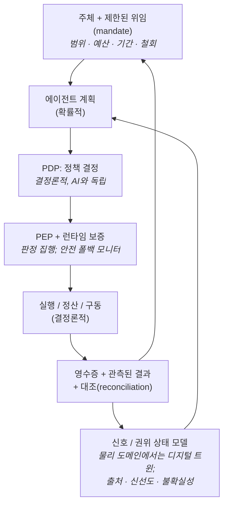

# open-sde
**소프트웨어 정의 경제(Software-Defined Economy)에 대한 오픈 리서치**

[English](README.md) · 🌐 한국어

Open-SDE는 **Mossland Lab**(lab@moss.land)이 시작한 오픈 리서치 이니셔티브이며,
하나의 질문에 대한 **범용·범도메인 참조 모델(reference model)**입니다.

> 소프트웨어 에이전트가 실물 경제에서 행동할 때, **누가 그 권한을 부여하고, 그 권한을
> 어떻게 제한·철회하며, 확률적 AI 판단을 결정론적 인가·실행·정산·책임과 어떻게 분리할
> 것인가?**

핵심 개념은 **보증된 제한적 자율성(assured bounded autonomy)**입니다. 즉 소프트웨어는
**기계가 강제할 수 있는 정책(machine-enforceable policy)** 아래에서 **제한된 결정**을
실행하며, 그 경계는 인간이 설정합니다. 이 저장소는 **작업 정의(working definition), 참조
아키텍처, 적합성 프레임**이며, 실제 구동 시스템이나 또 하나의 에이전트·결제 구현체가
**아닙니다.**

> *최종 업데이트: 2026년 7월.* 분야의 현재 상태는
> **[docs/landscape-2026.md](docs/landscape-2026.md)**에 날짜·출처와 함께 정리되어 있으며,
> 저장소의 모든 사실 주장은 **[docs/references.md](docs/references.md)**의 1차 출처에
> 연결됩니다.

---

## 작업 정의 (Working definition)

> **소프트웨어 정의 경제**란, **위임된 권한(delegated authority) 아래에서 동작하는
> 소프트웨어 에이전트가, 명시적 정책·인가·실행·정산·책임 통제를 통해 희소 자원을 배분하거나
> 상태를 변경하는 행동을 개시하는 사회·기술 시스템**이다.

"소프트웨어 정의 경제"는 확립된 표준 용어가 아니라 **Open-SDE의 작업 용어**입니다. 2025–2026년
주류 담론은 유사한 개념을 *에이전틱 경제(agentic economy)*(a16z, Stripe, Circle, WEF),
*프로그래머블 경제·기계 고객(machine customers)*(Gartner), *머신/에이전트 경제*(McKinsey)로
부릅니다. 전체 포지셔닝과 범위·비목표(non-goals)는
[docs/working-definition-and-scope.md](docs/working-definition-and-scope.md),
용어는 [docs/concepts.md](docs/concepts.md)를 참고하세요.

---

## 두 가지 설계 원칙

이 저장소의 모든 내용은 두 가지 설계 원칙에서 나오며, 둘 다 이 저장소가 발명한 것이 아닙니다.

1. **확률적인 것과 결정론적인 것을 분리한다.** 추론·의도 형성·오케스트레이션은 확률적일 수
   있으나, **인가·통제·정산·책임은 결정론적이고 감사 가능해야 한다.** 이는 IMF의 2026년 4월
   노트 *How Agentic AI Will Reshape Payments*의 핵심 논지입니다.
2. **거버넌스 게이트를 결정자와 집행자로 분리한다** — **정책 결정점(PDP)**과 **정책 집행점
   (PEP)**으로, 2026년 1월 OpenID **AuthZEN Authorization API 1.0**으로 표준화되었습니다 —
   그리고 신뢰할 수 없는 복잡한 에이전트를 **검증된 런타임 보증(runtime assurance)** 모니터로
   제한하여 안전 모드로 되돌립니다(Simplex 아키텍처, ASTM F3269-21로 확립된 안전공학 패턴).

에이전트의 추론이 탈취되더라도 그것은 여전히 *요청*만 할 수 있을 뿐, 스스로 권한을 확대할 수
없습니다. 결정과 집행 구성요소가 **모델 외부**에 있기 때문입니다.

---

## 보증된 제한적 자율성 루프

*에이전트 계획*과 *PDP* 사이의 점선이 확률적/결정론적 경계입니다. 신원·위임·출처·예산·감사·복구는
모든 단계를 관통합니다. 이 루프는 실제 사례와 각 노드를 2026년 실제 기술에 매핑하여
**[docs/reference-architecture.md](docs/reference-architecture.md)**에서 확장됩니다.

기존 스케치 대비 용어 변화에 유의하세요. 일반형은 **권위 상태 모델(Authoritative State Model)**
이며 *디지털 트윈*은 그 물리 도메인 특수형입니다. 에이전트는 "1급 경제 주체"가 아니라 **위임된
권한 아래 동작하는 소프트웨어 에이전트**입니다. 인간의 역할은 사라지지 않고 개별 승인에서
**권한·예산 설정, 모니터링, 철회, 예외 처리**로 이동합니다. *AI는 추천하고, 경계는 인간이
결정합니다.*

---

## 이 저장소가 무엇이며 — 무엇이 아닌지

| Open-SDE는 **이것이다** | Open-SDE는 **이것이 아니다** |
| --- | --- |
| 범용·범도메인 참조 모델: 권한·안전·평가 | 또 하나의 에이전트 프레임워크·오케스트레이터·결제 레일 |
| 토큰·체인·제품 중립 | Mossland 전용 또는 크립토 전용 설계 |
| 작업 정의, 참조 아키텍처, **SDE-0** 적합성 프레임 | 표준·인증 체계·운영 준비 완료 시스템 |
| 날짜·출처가 달린 1차 자료에 근거, 미검증 주장 제외 | 새로운 미인용 통계의 출처 |

Mossland 자체 시스템은 **사례 연구(case study)**로만 다루며, 루프 및 SDE-0에 매핑됩니다:
[docs/case-studies/mossland-crosswalk.md](docs/case-studies/mossland-crosswalk.md).

---

## SDE-0 — 최소 적합성 프로파일 *(작업 초안)*

이 저장소의 고유한 기여는 **검증 가능한 최소 기준선**입니다. 다음을 갖추면 **SDE-0 적합**입니다.
(1) 식별 가능한 주체·소유/운영자·에이전트, (2) 범위·예산·기간·대상·철회 조건을 담은 **위임
(mandate)**, (3) 출처·시각·신선도·불확실성을 담은 상태 입력, (4) **AI와 독립적인 PDP/PEP**,
(5) 멱등성·레이트 제한·예산 상한·안전 폴백을 갖춘 실행, (6) 실행 영수증과 관측 결과의
**대조(reconciliation)**, (7) 지속 모니터링·사고 기록·복구·인간 오버라이드.

자세한 내용은 [docs/sde-0-conformance-profile.md](docs/sde-0-conformance-profile.md), 기계 판독용
[`schemas/`](schemas/), 그리고 [`assurance/`](assurance/)의 실패 분류·해저드 로그를 참고하세요.

---

## 문서

| 문서 | 내용 |
| --- | --- |
| [docs/working-definition-and-scope.md](docs/working-definition-and-scope.md) | 정의, 비목표, 인접 용어 매핑, 프로토콜 성숙도 표 |
| [docs/reference-architecture.md](docs/reference-architecture.md) | 보증된 제한적 자율성 루프의 확장, 다이어그램과 사례 |
| [docs/authority-and-safety-model.md](docs/authority-and-safety-model.md) | 위임된 권한, mandate, PDP/PEP, 런타임 보증, 대조, **비주장(non-claims)** |
| [docs/sde-0-conformance-profile.md](docs/sde-0-conformance-profile.md) | SDE-0의 7개 요건과 이를 뒷받침하는 스키마 |
| [docs/landscape-2026.md](docs/landscape-2026.md) | 대표 서베이: 2026년 중반 실제로 출시된 것들, 날짜·출처 포함 |
| [docs/concepts.md](docs/concepts.md) | 실행 프리미티브와 용어집 |
| [docs/agent-native-economy.md](docs/agent-native-economy.md) · [reality-anchored-execution.md](docs/reality-anchored-execution.md) · [governance-as-code.md](docs/governance-as-code.md) | 세 가지 핵심 연구 영역 |
| [docs/references.md](docs/references.md) | 주석 달린 참고문헌·출처 원천(*제외된* 주장 포함) |
| [ROADMAP.md](ROADMAP.md) | 열린 연구 질문과 주제별 아젠다 |
| [schemas/](schemas/) · [assurance/](assurance/) | 루프용 JSON 스키마; 실패 분류·해저드 로그·사고/복구 노트 |

---

## 비주장 (Non-claims)

Open-SDE는 **주장하지 않는 것**에 대해서도 엄격합니다. 요약하면: 디지털 트윈은 실측 진실이
아니며, 시뮬레이션 통과는 현실 안전 인증이 아니고, 에이전트 인증은 특정 행동의 인가가 아니며,
블록체인 불변성은 외부 입력·물리 결과의 진실성을 보증하지 않고, 트랜잭션 성공은 실제 결과 성공이
아니며, 토큰 보유는 법적 소유권·집행 권한이 아니고, 정책-as-code는 법·조직 책임·기능안전 절차를
대체하지 않으며, **Open-SDE는 연구 프레임이지 표준이나 운영 준비 완료 시스템이 아닙니다.** 근거를
포함한 전체 목록은 [docs/authority-and-safety-model.md](docs/authority-and-safety-model.md#7-eight-non-claims)에
있습니다.

---

## 산출물

**현재 저장소에 있는 것:** 작업 정의·범위, 참조 아키텍처, 권한·안전 모델, SDE-0 적합성 프로파일,
JSON 스키마, 어슈어런스 분류·해저드 로그, 2026 랜드스케이프 서베이, 주석 달린 참고문헌.

**계획됨(아직 없음):** 최소 참조 루프(상태 시뮬레이터 → 확률적 플래너 → 결정론적 PDP/PEP →
멱등 실행기 → 대조)와 실패 주입. Mossland의 `BRIDGE 2026`·`agentic-orchestrator`와 중복되지
않도록 *하나의* 참조 구현으로 범위를 한정합니다. [ROADMAP.md](ROADMAP.md)에서 추적합니다.

---

## 상태

🌱 인큐베이션  
📖 작업 정의  
🚧 참조 구현 아직 없음  
🌍 오픈 리서치  

이 저장소는 완성된 백서 저장소가 **아닙니다.** 반복·미완성 아이디어·수정이 예상되며, 모든 주장에
날짜를 달아 정직하게 낡아가도록 했습니다.

---

## 라이선스

[MIT License](LICENSE). 출처 표기 시 재사용 가능합니다. [CITATION.cff](CITATION.cff) 참고.

---

## 시작

**Mossland Lab**  
📧 lab@moss.land  

Mossland Lab은 **AI는 추천하고 인간이 결정한다**는 원칙 아래, 현실 세계의 소프트웨어 정의 실행을
위한 에이전트 시스템·디지털 트윈·실행형 거버넌스에 대한 오픈 리서치를 수행합니다.
