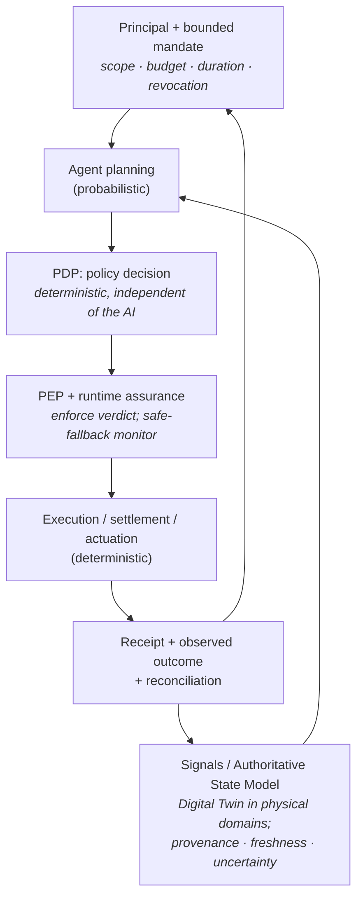

# open-sde
**Open Research on the Software-Defined Economy**

🌐 English · [한국어](README.ko.md)

Open-SDE is an open research initiative **initiated by Mossland Lab**
(lab@moss.land). It is a **general, cross-domain reference model** for one question:

> When software agents act in the real economy, **who grants them authority, how is that
> authority bounded and revoked, and how do we separate probabilistic AI judgment from
> deterministic authorization, execution, settlement, and accountability?**

The organizing idea is **assured bounded autonomy**: software executes bounded decisions
under machine-enforceable policies, with humans setting the bounds. This repository is a
**working definition, reference architecture, and conformance frame** — not a running
system, and not another agent or payments implementation.

> *Last updated: July 2026.* The current state of the field is surveyed, dated, and cited
> in **[docs/landscape-2026.md](docs/landscape-2026.md)**; every factual claim in this
> repository is anchored to a primary source in **[docs/references.md](docs/references.md)**.

---

## Working definition

> A **Software-Defined Economy** is a socio-technical system in which **software agents,
> operating under delegated authority, allocate scarce resources or initiate state-changing
> actions through explicit policy, authorization, execution, settlement, and accountability
> controls.**

"Software-Defined Economy" is **Open-SDE's working term**, not an established standard term.
Mainstream 2025–2026 discourse describes overlapping ideas as the *agentic economy*
(a16z, Stripe, Circle, WEF), the *programmable economy* and *machine customers* (Gartner),
and the *machine / agent economy* (McKinsey). See
[docs/working-definition-and-scope.md](docs/working-definition-and-scope.md) for the full
positioning, scope, and non-goals, and [docs/concepts.md](docs/concepts.md) for vocabulary.

---

## Two commitments

Everything in this repository follows from two design commitments — neither invented here:

1. **Separate the probabilistic from the deterministic.** Reasoning, intent, and
   orchestration may be probabilistic; **authorization, control, settlement, and
   accountability must be deterministic and auditable.** This is the central argument of the
   IMF's April 2026 note *How Agentic AI Will Reshape Payments*.
2. **Split the governance gate into a decider and an enforcer** — a **Policy Decision Point
   (PDP)** and a **Policy Enforcement Point (PEP)**, standardized in January 2026 as the
   OpenID **AuthZEN Authorization API 1.0** — and bound the untrusted, complex agent with a
   verified **runtime-assurance** monitor that reverts to a safe mode, an established
   safety-engineering pattern (Simplex architecture; ASTM F3269-21).

An agent whose reasoning is hijacked can still only *request*; it cannot enlarge its own
authority, because the deciding and enforcing components sit **outside the model**.

---

## The assured-bounded-autonomy loop

The dashed boundary between *Agent planning* and *PDP* is the probabilistic/deterministic
line. Identity, delegation, provenance, budget, audit, and recovery thread through every
stage. The loop is expanded — with worked examples and each node mapped to real 2026
technology — in **[docs/reference-architecture.md](docs/reference-architecture.md)**.

Note the vocabulary shift from the repository's earlier sketch: the general term is the
**Authoritative State Model** (a *Digital Twin* is its physical-domain specialization), and
agents are **software agents acting under delegated authority**, never "first-class economic
actors." The human role does not disappear — it moves from per-action approval to **setting
authority, budgets, monitoring, revocation, and exception handling**. *AI recommends; humans
decide the bounds.*

---

## What this repository is — and is not

| Open-SDE **is** | Open-SDE **is not** |
| --- | --- |
| A general, cross-domain reference model: authority, safety, and evaluation | Another agent framework, orchestrator, or payment rail |
| Token-, chain-, and product-neutral | A Mossland-specific or crypto-specific design |
| A working definition, a reference architecture, and the **SDE-0** conformance frame | A standard, a certification scheme, or an operationally-ready system |
| Anchored to dated, cited primary sources; unverifiable claims excluded | A source of new, uncited statistics |

Mossland's own systems are treated only as **case studies**, mapped to the loop and to SDE-0
in [docs/case-studies/mossland-crosswalk.md](docs/case-studies/mossland-crosswalk.md).

---

## SDE-0 — Minimum Conformance Profile *(working draft)*

The repository's distinctive contribution is a checkable floor. A system is **SDE-0
conformant** if it has: (1) identifiable principal, owner/operator, and agent; (2) a
**mandate** with scope, budget, duration, target, and revocation; (3) state inputs carrying
provenance, timestamp, freshness, and uncertainty; (4) a **PDP/PEP independent of the AI**;
(5) execution with idempotency, rate limits, budget caps, and a safe fallback; (6)
**reconciliation** of the execution receipt against the observed outcome; and (7) continuous
monitoring, incident logging, recovery, and human override.

See [docs/sde-0-conformance-profile.md](docs/sde-0-conformance-profile.md), the machine-readable
[`schemas/`](schemas/), and the [`assurance/`](assurance/) taxonomy and hazard log.

---

## Documentation

| Document | What it covers |
| --- | --- |
| [docs/working-definition-and-scope.md](docs/working-definition-and-scope.md) | The definition, non-goals, adjacent-term mapping, and a protocol-maturity table |
| [docs/reference-architecture.md](docs/reference-architecture.md) | The assured-bounded-autonomy loop, expanded, with diagrams and worked examples |
| [docs/authority-and-safety-model.md](docs/authority-and-safety-model.md) | Delegated authority, mandates, PDP/PEP, runtime assurance, reconciliation, and the **non-claims** |
| [docs/sde-0-conformance-profile.md](docs/sde-0-conformance-profile.md) | The seven SDE-0 requirements and the schemas that back them |
| [docs/landscape-2026.md](docs/landscape-2026.md) | Flagship survey: what has actually shipped across the loop in mid-2026, dated and cited |
| [docs/concepts.md](docs/concepts.md) | Executable primitives and a glossary |
| [docs/agent-native-economy.md](docs/agent-native-economy.md) · [reality-anchored-execution.md](docs/reality-anchored-execution.md) · [governance-as-code.md](docs/governance-as-code.md) | The three core research areas |
| [docs/references.md](docs/references.md) | Annotated reading list and source of truth (including *excluded* claims) |
| [ROADMAP.md](ROADMAP.md) | Open research questions and a themed agenda |
| [schemas/](schemas/) · [assurance/](assurance/) | JSON Schemas for the loop; failure taxonomy, hazard log, and incident/recovery notes |

---

## Non-claims

Open-SDE holds itself to what it does **not** assert. In brief: a Digital Twin is not ground
truth; a passing simulation is not a real-world safety certification; authenticating an agent
is not authorizing a specific action; blockchain immutability does not make external inputs or
physical outcomes true; a successful transaction is not a successful outcome; holding a token
is not legal ownership or execution authority; policy-as-code does not replace law,
organizational responsibility, or functional-safety practice; and **Open-SDE is a research
frame, not a standard or an operationally-ready system.** The full list, with reasoning, is in
[docs/authority-and-safety-model.md](docs/authority-and-safety-model.md#7-eight-non-claims).

---

## Artifacts

**Present in this repository:** the working definition and scope, the reference architecture,
the authority-and-safety model, the SDE-0 conformance profile, JSON schemas, an assurance
taxonomy and hazard log, the 2026 landscape survey, and the annotated references.

**Planned (not yet here):** a minimal reference loop (state simulator → probabilistic planner
→ deterministic PDP/PEP → idempotent executor → reconciliation) with failure injection,
scoped deliberately to *one* reference implementation so it does not duplicate Mossland's
`BRIDGE 2026` or `agentic-orchestrator`. Tracked in [ROADMAP.md](ROADMAP.md).

---

## Status

🌱 Incubation  
📖 Working definition  
🚧 No reference implementation yet  
🌍 Open research  

This is **not** a polished whitepaper repository. Iteration, incomplete ideas, and revisions
are expected, and every claim is dated so it can age honestly.

---

## License

[MIT License](LICENSE). Content may be reused with attribution; see [CITATION.cff](CITATION.cff).

---

## Initiated by

**Mossland Lab**  
📧 lab@moss.land  

Mossland Lab conducts open research on agentic systems, digital twins, and executable
governance for software-defined execution in the real world, guided by the principle that
**AI recommends and humans decide**.
