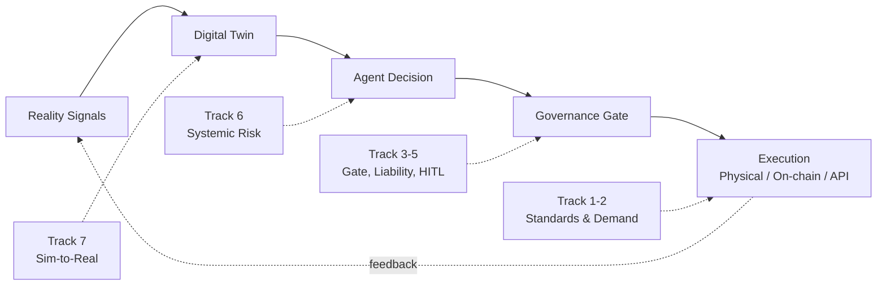

# Open-SDE Research Roadmap and Open Questions

*A prioritized research agenda for the Software-Defined Economy: the questions that mid-2026 evidence makes urgent, tied to the reference loop and the three core research areas.*

*Last updated: July 2026 · Part of the [Open-SDE](./README.md) research initiative.*

---

## How to read this roadmap

The disciplined reading of the 2025–2026 evidence (see [docs/landscape-2026.md](./docs/landscape-2026.md)) is that the **rails, primitives, and standards of the [Software-Defined Economy](./docs/concepts.md#glossary) now largely exist, while realized, non-synthetic economic activity through them is still early.** That gap — between deployed infrastructure and clearing demand — is the single most important thing this repository tries not to overstate, and it shapes every item below.

This roadmap is therefore organized as research *tracks*, not as a delivery schedule. Each track states the open question, the evidence that makes it pressing, concrete **signals to watch**, and an explicit maturity label so contributors do not confuse an installed capability with a proven outcome:

| Label | Meaning |
| --- | --- |
| **[Shipping]** | The underlying infrastructure is in production or general availability today; the open question is about consequences, not feasibility. |
| **[Early]** | Real deployments exist but are limited, partly confirmed, or measured at small scale; the question is whether they hold up. |
| **[Speculative]** | The capability is demonstrated only in simulation, promised, or asserted without primary corroboration; the question is whether it becomes real at all. |

Every non-obvious claim below is dated and linked to its source, prioritizing primary sources (standards bodies, vendors, regulators) and flagging where a figure rests on secondary or on-chain analysis. Where the fact-checked research flagged a figure as uncertain, this document hedges accordingly.

*The tracks below map onto the reference loop: convergence and demand questions sit at Execution; governance, accountability, and SDE-0 conformance questions at the Governance Gate; systemic-risk questions at the Agent-Decision node; and sim-to-real questions at the Digital Twin.*

---

## Track 1 — Standards convergence vs. fragmentation

**Open question:** Will the competing payment, identity, and settlement stacks converge into one interoperable trust-and-settlement fabric, or fragment along hyperscaler lines? Interoperability across the credential layer, the merchant/schema layer, and the settlement layer is the central Software-Defined Economy question.

**Maturity: [Shipping] infrastructure, [Early] convergence.**

The rails exist and are being handed to neutral bodies. Coinbase and Cloudflare's [x402](./docs/concepts.md#glossary) was formalized under the [Linux Foundation on April 2, 2026](https://www.linuxfoundation.org/press/linux-foundation-is-launching-the-x402-foundation-and-welcoming-the-contribution-of-the-x402-protocol) with 20+ founding members including Visa, Mastercard, Google, AWS, Circle, and Stripe. Google donated its Agent Payments Protocol (AP2) to the [FIDO Alliance in April 2026](https://blog.google/products-and-platforms/platforms/google-pay/agent-payments-protocol-fido-alliance/), and the [A2A protocol reached a stable v1.0 under the Linux Foundation](https://www.linuxfoundation.org/press/a2a-protocol-surpasses-150-organizations-lands-in-major-cloud-platforms-and-sees-enterprise-production-use-in-first-year) (April 9, 2026) with 150+ organizations. The OpenAI + Stripe [Agentic Commerce Protocol](https://stripe.com/newsroom/news/stripe-openai-instant-checkout) powers ChatGPT Instant Checkout, and Stripe/Tempo's [Machine Payments Protocol](https://stripe.com/blog/machine-payments-protocol) (March 2026) offers a competing HTTP-402 stack.

The tension is that these remain **competing camps** — AP2/UCP vs. ACP/MPP vs. x402 vs. card-network credentials — even though membership overlaps heavily (Visa, Mastercard, Google, and AWS appear across several). Convergence is plausible but unproven.

**Signals to watch:**
- Whether a single agent can present one credential/mandate honored across x402, AP2, ACP, and MPP without per-protocol routing.
- Whether the NIST/CAISI [AI Agent Standards Initiative](https://www.nist.gov/news-events/news/2026/02/announcing-ai-agent-standards-initiative-interoperable-and-secure) (Feb 17, 2026) and its NCCoE OAuth 2.0 + SPIFFE/SPIRE + MCP identity work produce a shared identity substrate, or a competing one.
- Whether card networks' neutral on-ramps (Visa Intelligent Commerce Connect; [Mastercard Agent Pay for Machines](https://www.mastercard.com/us/en/news-and-trends/press/2026/june/mastercard-launches-agent-pay-for-machines.html), June 10, 2026) subsume or fracture the open protocols.

---

## Track 2 — Real vs. synthetic demand

**Open question:** How much genuine, non-gamed autonomous-agent economic activity exists, and does it justify the ecosystem valuations — is mid-2026 a genuine inflection or a premature over-build?

**Maturity: [Early].**

This is the roadmap's most important reality check. On-chain analysis reported by [CoinDesk (March 11, 2026)](https://www.coindesk.com/markets/2026/03/11/coinbase-backed-ai-payments-protocol-wants-to-fix-micropayment-but-demand-is-just-not-there-yet) found x402 processing only about **$28,000 in daily volume** despite an ecosystem valued near $7 billion, with roughly half of observed transactions judged artificial. Against that, the load-bearing positive measurement is the Keyrock analysis via [CoinDesk (May 21, 2026)](https://www.coindesk.com/business/2026/05/21/crypto-rails-are-becoming-the-default-payment-layer-for-ai-agents-report-says): agents settled roughly **176 million on-chain transactions worth over $73 million** between May 2025 and April 2026, 98.6% in USDC, with about 76% of payments below the ~30-cent card-fee floor. Real, but small.

On the enterprise side, Gartner's [August 2025 forecast](https://www.gartner.com/en/newsroom/press-releases/2025-08-26-gartner-predicts-40-percent-of-enterprise-apps-will-feature-task-specific-ai-agents-by-2026-up-from-less-than-5-percent-in-2025) projects ~40% of enterprise apps will feature task-specific agents by 2026 (up from <5%), while also expecting **more than 40% of agentic AI projects to be canceled by 2027** over cost and weak ROI. Secondary trackers report that roughly 88–89% of agent pilots never reach production (this specific figure comes from industry roundups, not the Gartner release, and should be cited as such).

**Signals to watch:**
- The ratio of organic to test/gamed transactions in x402/MPP telemetry over successive quarters.
- Whether the ~11–12% of pilots that scale grow as a share, and what they have in common.
- Whether measured agent settlement volume grows into the ecosystem's implied valuation, or the valuation compresses toward the volume.

---

## Track 3 — Governance-gate encoding: what makes the minority scale

**Open question:** Which governance, cost, and reliability primitives distinguish the small minority of agent pilots that reach production — and can the [governance gate](./docs/concepts.md#glossary) encode them by default? Relatedly, can regulatory obligations carry machine-checkable policy-to-code traceability — linking a rule to the code that enforces it — rather than resting only on document-and-audit conformity?

**Maturity: [Shipping] runtime gates, [Speculative] machine-checkable regulation.**

Governance moved from prose to runtime enforcement in 2026. Microsoft open-sourced the MIT-licensed [Agent Governance Toolkit](https://opensource.microsoft.com/blog/2026/04/02/introducing-the-agent-governance-toolkit-open-source-runtime-security-for-ai-agents/) (April 2, 2026), whose Agent OS intercepts every agent action before execution at sub-millisecond latency, with CPU-style execution rings and kill switches. In parallel, the recommended containment pattern shifted to enforcing [Open Policy Agent](./docs/concepts.md#glossary) at the tool-calling / MCP-gateway layer so a hijacked agent is blocked before reaching upstream systems. The threat model this defends against is now codified in OWASP's first [Top 10 for Agentic Applications](https://genai.owasp.org/2025/12/09/owasp-top-10-for-agentic-applications-the-benchmark-for-agentic-security-in-the-age-of-autonomous-ai/) (Dec 9, 2025), led by Agent Goal Hijack (ASI01).

The harder, unresolved half is regulation. EU AI Act GPAI obligations have applied since Aug 2, 2025, with [Commission enforcement powers exercisable Aug 2, 2026](https://artificialintelligenceact.eu/enforcement-of-chapter-v-under-the-eu-ai-act/) — yet the [Digital Omnibus](https://www.consilium.europa.eu/en/press/press-releases/2026/06/29/artificial-intelligence-council-gives-final-green-light-to-simplify-and-streamline-rules/) (Council green light June 29, 2026) deferred most high-risk (Annex III) obligations to Dec 2, 2027 and Annex I to Aug 2, 2028. That delay is itself a signal: the machine-checkable CEN-CENELEC technical standards a policy-as-code engine would consume are not yet ready, so conformity remains largely document-and-audit based, limiting how much of the loop can be automated.

**Signals to watch:**
- Whether runtime toolkits (Agent OS, OPA gateways) ship reference policy libraries mapping directly to OWASP ASI01–ASI10 by default.
- Whether CEN-CENELEC produces machine-consumable conformity specs, or whether ISO/IEC 42001 [certification](https://www.a-lign.com/articles/understanding-iso-42001) remains the audit-based fallback.
- Whether Singapore's risk-factor [agentic-AI governance framework](https://www.imda.gov.sg/resources/press-releases-factsheets-and-speeches/press-releases/2026/new-model-ai-governance-framework-for-agentic-ai) (Jan 22, 2026) becomes a transferable template for encoding autonomy limits as executable constraints.

---

## Track 4 — Liability and accountability

**Open question:** Who is responsible when a hijacked or misaligned agent executes a harmful action *despite* a passing policy gate or a signed mandate — the model provider, the deploying organization, or the policy author? How is that attribution encoded and audited?

**Maturity: [Early] identity substrate, [Speculative] liability model.**

The identity substrate needed for attribution is emerging: Microsoft [Entra Agent ID](https://learn.microsoft.com/en-us/entra/agent-id/whats-new-agent-id) treats agents as credentialed, revocable identities; the still-Draft [ERC-8004 Trustless Agents](https://eips.ethereum.org/EIPS/eip-8004) proposal, whose reference Identity/Reputation/Validation registries were deployed to Ethereum mainnet (Jan 29, 2026) even as the specification itself remains unfinalized; and authorization instruments like the WEF/Capgemini [Agent Capability and Authorization Profile (ACAP)](https://www.weforum.org/publications/ai-agents-in-action-a-playbook-for-trusted-adoption-authorization-and-scaling/) (May 26, 2026) and a16z's [Know Your Agent](https://a16z.com/newsletter/big-ideas-2026-part-1/) (Dec 2025) document delegated power in a single auditable record.

But identity is necessary, not sufficient. None of these instruments resolves *legal* liability when a signed mandate authorized the transaction but the outcome was harmful — a live failure mode given that Agent Goal Hijack is the top-ranked agentic risk. The accountability question is the gap between "the gate passed" and "the action was right."

**Signals to watch:**
- The first published post-incident attribution using ERC-8004 or ACAP records as evidence.
- Whether mandate/token standards (AP2 Mandates, ACP Shared Payment Tokens, Mastercard Agentic Tokens) add explicit liability-bearing fields, not just consent scope.
- Whether regulators treat a passing policy gate as a safe harbor or as no defense.

---

## Track 5 — The reversibility and human-in-the-loop boundary

**Open question:** Which economic actions — moving money, changing access, making irreversible commitments — must remain human-gated, and how should that boundary map to risk tiers?

**Maturity: [Shipping] mechanisms, [Early] boundary consensus.**

The mechanisms to insert a human now exist in protocol. The MCP [2026-07-28 release candidate](https://blog.modelcontextprotocol.io/posts/2026-07-28-release-candidate/) standardizes human-in-the-loop confirmation via Multi Round-Trip Requests (SEP-2322, `InputRequiredResult`) alongside hardened OAuth 2.1/OIDC authorization. Payment primitives encode scoped, reversible-by-design authority: [Coinbase Agentic Wallets](https://www.coinbase.com/developer-platform/discover/launches/agentic-wallets) (Feb 11, 2026) with session caps and spend limits, and MPP's "sessions" spend-cap primitive. Singapore's framework already frames the decision in terms of reversibility, autonomy level, and read-vs-write permissions.

What is *not* settled is where the line sits. There is no cross-industry consensus on which action classes are always human-gated versus safely automatable, nor a shared mapping from risk tier to gate strictness.

**Signals to watch:**
- Whether a common taxonomy of "always human-gated" actions (irreversible money movement, access changes, legal commitments) emerges across the payment and governance stacks.
- Whether risk-factor frameworks (Singapore) are adopted as executable gate configurations rather than advisory guidance.
- Default HITL thresholds shipped in agent SDK harnesses.

---

## Track 6 — Systemic risk: concentration, lock-in, and single points of failure

**Open question:** How much systemic fragility does the current build-out introduce through concentration — a single dominant settlement stablecoin, a handful of proprietary agent runtimes, and sub-millisecond policy engines that could become single points of failure?

**Maturity: [Shipping] concentration, [Speculative] mitigations.**

The concentration is measurable. **98.6% of agent settlements are in USDC** ([Keyrock/CoinDesk, May 2026](https://www.coindesk.com/business/2026/05/21/crypto-rails-are-becoming-the-default-payment-layer-for-ai-agents-report-says)), placing systemic dependency on one stablecoin issuer. The [agent SDK/harness layer](./docs/concepts.md#glossary) has consolidated around a few proprietary runtimes — [Microsoft Agent Framework 1.0](https://learn.microsoft.com/en-us/agent-framework/overview/) (April 2026), [OpenAI's Agents SDK](https://openai.com/index/the-next-evolution-of-the-agents-sdk/) (April 15, 2026), and Anthropic's [Claude Agent SDK / Managed Agents](https://claude.com/blog/new-in-claude-managed-agents) (May 6, 2026) — meaning executable economic rules increasingly run on a small number of vendor platforms. And the same runtime policy engines that make governance possible become chokepoints: OWASP's threat model explicitly flags kill-switch cascades in multi-agent systems (ASI08), where halting one agent triggers dependent failures.

**Signals to watch:**
- Whether agent settlement diversifies across stablecoin issuers (PYUSD, others) or deepens USDC dependency.
- Whether an open, portable agent-runtime standard emerges to counter proprietary lock-in.
- Documented incidents of policy-engine bottlenecks or kill-switch cascades in production multi-agent systems.

---

## Track 7 — Sim-to-real and governance for physical action

**Open question:** What validation standards should govern deploying an agent policy proven only in simulation, and how are certification and post-incident audit handled for embodied agents acting on the physical world?

**Maturity: [Early] paid deployment, [Speculative] certified physical governance.**

Reality-anchored execution reached early paid deployment. NVIDIA's [Omniverse DSX digital-twin Blueprint](https://nvidianews.nvidia.com/news/nvidia-releases-vera-rubin-dsx-ai-factory-reference-design-and-omniverse-dsx-digital-twin-blueprint-with-broad-industry-support) went GA (March 16, 2026), providing a validation substrate where policies are rehearsed against physics before execution ([world models and the Mega Blueprint](https://blogs.nvidia.com/blog/gtc-2026-virtual-worlds-physical-ai/) extend this). VLA foundation models such as [Gemini Robotics 1.5](https://deepmind.google/blog/gemini-robotics-15-brings-ai-agents-into-the-physical-world/) transfer one policy across robot bodies, and [Figure moved into a paid commercial contract at BMW Spartanburg](https://www.figure.ai/news/production-at-bmw) while [Amazon's DeepFleet](https://www.aboutamazon.com/news/operations/amazon-million-robots-ai-foundation-model) orchestrates a 1M+ robot fleet.

The caveat is the widest gap in this repository between proven and promotional. Several headline "machine economy" milestones — notably [peaq/Serve Robotics settling a delivery in USDT on-chain](https://cryptonews.net/news/altcoins/32906537/) (May 12, 2026) — remain **simulation-only**. Sector market-cap and device figures ($40B–$900B+) are inconsistent across promotional secondary sources, and an "autonomous AI grid operator" claim was found unverifiable and **excluded from this repository** (see Track 9). There is no certified governance gate for autonomous physical action.

**Signals to watch:**
- The first simulation-validated policy deployed to live streets (not a controlled simulator) with a documented sim-to-real validation standard.
- Whether industrial digital-twin formats interoperate or consolidate around a single vendor.
- Emergence of certification and post-incident audit regimes specific to embodied agents.

---

## Track 8 — SDE-0 conformance and the PDP/PEP boundary

**Open question:** Where exactly should the line fall between the probabilistic layer (reasoning, intent, orchestration) and the deterministic layer (authorization, control, settlement) — and how does a program *test* that a deployment actually honors that separation rather than merely asserting it? Concretely: what must live inside the deterministic gate, how is [SDE-0 conformance](./docs/sde-0-conformance-profile.md) checked, and how is a runtime-assurance monitor certified as trustworthy?

**Maturity: [Shipping] control-plane standards, [Speculative] conformance and certification.**

The architectural commitment is now backed by primary sources rather than assertion. The IMF's [How Agentic AI Will Reshape Payments](https://www.imf.org/en/publications/imf-notes/issues/2026/04/22/how-agentic-ai-will-reshape-payments-575560) (Note 2026/004, April 22, 2026) argues for concentrating probabilistic reasoning upstream in intent formation and orchestration while the authorization/control and settlement layers stay deterministic, rules-bound, and auditable — the same split the [authority-and-safety model](./docs/authority-and-safety-model.md) encodes. The control-plane standard for enforcing that split now exists: the [OpenID AuthZEN Authorization API 1.0](https://openid.net/specs/authorization-api-1_0.html) reached Final Specification status (approved by the OpenID Foundation membership on January 12, 2026), formalizing the separation between a Policy Decision Point (which evaluates policy) and a Policy Enforcement Point (which intercepts and enforces) that the governance gate depends on. And the pattern of bounding an untrusted complex function with a verified safety monitor is decades-old safety-engineering practice — Lui Sha's Simplex Architecture — codified for aviation in [ASTM F3269-21](https://store.astm.org/f3269-21.html), "Standard Practice for Methods to Safely Bound Behavior of Aircraft Systems Containing Complex Functions Using Run-Time Assurance."

What is *not* settled is testing and certification. [SDE-0](./docs/sde-0-conformance-profile.md) states seven minimum requirements — an identifiable principal, owner/operator, and agent; a scoped, revocable mandate; provenance- and freshness-carrying state; a PDP/PEP independent of the AI; idempotent execution with budget caps and a safe fallback; reconciliation of the execution receipt against the observed outcome; and continuous monitoring with human override — but there is no accepted test suite that demonstrates a given deployment meets them, and no certification regime for the runtime-assurance monitor itself. NIST's [Challenges to the Monitoring of Deployed AI Systems](https://www.nist.gov/publications/challenges-monitoring-deployed-ai-systems-center-ai-standards-and-innovation) (AI 800-4, a final report dated March 6, 2026) documents exactly this gap for the monitoring dimension, mapping six monitoring categories — Functionality, Operational, Human Factors, Security, Compliance, and Large-Scale Impacts — while noting the practice remains fragmented. Its companion [AI Agent Standards Initiative](https://www.nist.gov/news-events/news/2026/02/announcing-ai-agent-standards-initiative-interoperable-and-secure) (Feb 17, 2026) has an open identity-and-authorization workstream but has not yet produced a finished conformance instrument.

**Signals to watch:**
- Whether any body publishes a conformance test or reference implementation that checks the deterministic gate is genuinely independent of the model (SDE-0 requirement 4), rather than an LLM effectively grading its own authorization.
- Whether runtime-assurance monitors acquire a certification path analogous to ASTM F3269-21's aviation lineage, or remain self-attested.
- Whether draft agent-identity substrates such as [ERC-8004](https://eips.ethereum.org/EIPS/eip-8004) (still Draft as of mid-2026) or the NIST identity-and-authorization work converge on a testable principal-and-mandate schema the PDP can consume.

---

## Track 9 — Evidence discipline (a standing methodological track)

**Open question:** How does an open research program keep distinguishing deployed infrastructure from realized economic activity as the hype cycle intensifies?

**Maturity: [Shipping] — this is a practice, not a prediction.**

This roadmap treats evidence discipline as a first-class deliverable. Contributors should **not reintroduce claims the fact-checking pass explicitly excluded**, including: an "autonomous AI grid operator" (sourced only to a content-farm article); OpenAI "Lockdown Mode"; A2A "v1.2" or an "Agentic AI Foundation" (the primary source says v1.0 under the Linux Foundation); specific METR statistics not stated on [METR's page](https://metr.org/time-horizons/) (which describes "over a hundred" tasks and gives no explicit doubling figure); and "ACT-1..ACT-4" autonomy tiers attributed to Singapore's framework (a separate vendor construct). METR itself flags task-horizon measurements above 16 hours as unreliable.

**Signals to watch:**
- New primary sources that would confirm any currently-[Speculative] item and move it to [Early] or [Shipping].
- Contradictions between promotional secondary figures and primary/on-chain measurements.

---

## Priority summary

| Track | Question in one line | Loop node | Maturity |
| --- | --- | --- | --- |
| 1. Standards convergence | One trust fabric, or fragmentation along hyperscaler lines? | Execution | [Shipping] / [Early] |
| 2. Real vs. synthetic demand | Genuine inflection or premature over-build? | Execution | [Early] |
| 3. Governance-gate encoding | What makes the minority scale; can regulation be machine-checkable? | Governance Gate | [Shipping] / [Speculative] |
| 4. Liability & accountability | Who is responsible when a passing gate still causes harm? | Governance Gate | [Early] / [Speculative] |
| 5. Reversibility & HITL boundary | Which actions must stay human-gated? | Governance Gate | [Shipping] / [Early] |
| 6. Systemic risk | Concentration in one stablecoin, few runtimes, single-point gates. | Agent Decision | [Shipping] / [Speculative] |
| 7. Sim-to-real & physical governance | Validation and certification for policies proven only in simulation. | Digital Twin | [Early] / [Speculative] |
| 8. SDE-0 conformance & PDP/PEP boundary | Where does deterministic end and probabilistic begin, and how is conformance tested? | Governance Gate | [Shipping] / [Speculative] |
| 9. Evidence discipline | Keep separating deployed infrastructure from realized activity. | (methodology) | [Shipping] |

The through-line: the strategic questions for a Software-Defined Economy research program in mid-2026 are about **consolidation and accountability, not feasibility.** The loop can be instantiated; whether its five stages integrate end-to-end, clear real demand, and remain governable is what remains open.

---

## Related

- [docs/landscape-2026.md](./docs/landscape-2026.md) — the dated, cited survey of what is actually shipping, which grounds every track above.
- [docs/working-definition-and-scope.md](./docs/working-definition-and-scope.md) — the canonical working definition of a Software-Defined Economy and the boundary of what this reference model covers.
- [docs/authority-and-safety-model.md](./docs/authority-and-safety-model.md) — the assured-bounded-autonomy model: delegated authority, the PDP/PEP split, runtime assurance, and the non-claims (Tracks 4, 8).
- [docs/sde-0-conformance-profile.md](./docs/sde-0-conformance-profile.md) — the seven-requirement SDE-0 minimum conformance profile (Track 8).
- [docs/concepts.md](./docs/concepts.md) — SDE definitions, primitives, and the glossary.
- [docs/agent-native-economy.md](./docs/agent-native-economy.md) — research area 1 (Tracks 2, 6).
- [docs/reality-anchored-execution.md](./docs/reality-anchored-execution.md) — research area 2 (Track 7).
- [docs/governance-as-code.md](./docs/governance-as-code.md) — research area 3 (Tracks 3, 4, 5).
- [docs/reference-architecture.md](./docs/reference-architecture.md) — the reference loop expanded, with worked instantiations.
- [docs/case-studies/mossland-crosswalk.md](./docs/case-studies/mossland-crosswalk.md) — a case study mapping the reference model onto Mossland's own systems.

See [docs/references.md](./docs/references.md) for the full, annotated source list.
