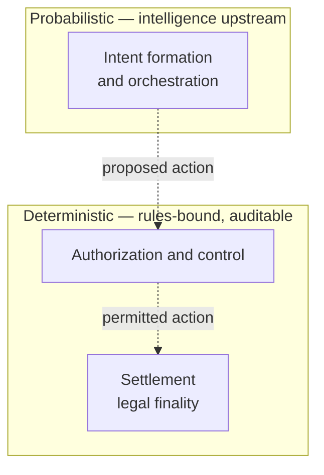
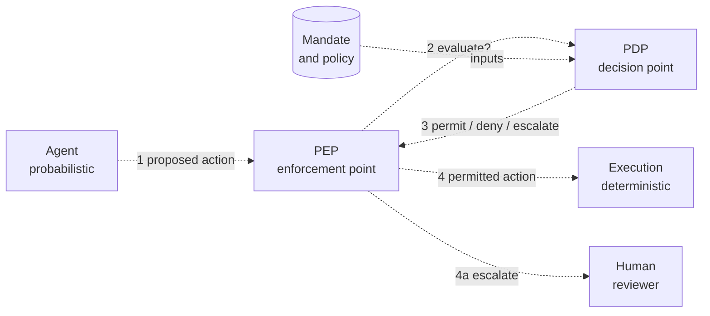
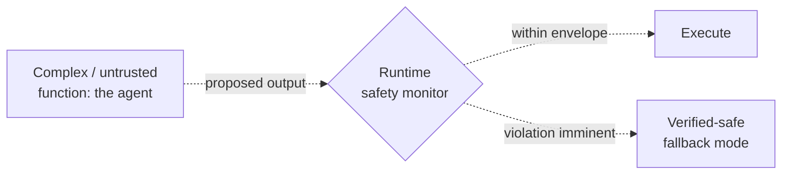

# Authority and Safety Model

*How authority is delegated to a software agent, how that authority is bounded and revoked, and how probabilistic judgment is separated from deterministic execution, settlement, and accountability.*

*Last updated: July 2026 · Part of the [Open-SDE](../README.md) research initiative.*

> **Maturity: Draft.** This is the repository's central design document. It composes
> established practice from authorization standards, payments infrastructure, and
> safety engineering into one model. The framing is a research proposal, not a
> standard or a certification scheme.

---

## Why this document exists

Most writing about "autonomous agents" argues that AI *can* act economically. That is
not the interesting question by mid-2026 — the rails already exist. The harder and more
neglected question is the one this document takes as its thesis:

> **Who grants an agent its authority, how is that authority bounded and revoked, and
> how is probabilistic AI judgment kept separate from the deterministic machinery of
> authorization, execution, settlement, and accountability?**

We call the answer **assured bounded autonomy**. An agent is never a "first-class
economic actor." It is a **software agent acting under delegated authority**, constrained
at every step by controls that do not themselves depend on the agent's reasoning being
correct. This document specifies those controls.

The canonical definition the repository works from:

> *A Software-Defined Economy is a socio-technical system in which software agents,
> operating under delegated authority, allocate scarce resources or initiate
> state-changing actions through explicit policy, authorization, execution, settlement,
> and accountability controls.*

See [working-definition-and-scope.md](working-definition-and-scope.md) for the scope of
that definition and [reference-architecture.md](reference-architecture.md) for the loop
these controls sit inside.

---

## 1. Delegated authority

Authority in an SDE is delegated down a chain of accountable parties. Three roles must
always be identifiable and distinct:

| Role | Definition | Accountability |
| --- | --- | --- |
| **Principal** | The human or legal entity on whose behalf the agent ultimately acts, and who bears the consequences of its actions. | Owns the outcome. |
| **Owner / operator** | The party that deploys, configures, and runs the agent, and who is answerable for its operation. | Owns the deployment. |
| **Agent** | The software actor — a model plus its harness — that forms intent and requests actions. | Executes within its mandate; never the terminal locus of responsibility. |

Separating these roles is what makes accountability possible. An agent's cryptographic
identity establishes *which* agent is acting and *for whom*, but — as the non-claims
below insist — identity is not authority. Authority is carried by an explicit, revocable
**mandate**.

### The mandate

A mandate is the machine-readable grant of authority from principal and operator to
agent. It is the object a decision point evaluates and an enforcement point holds the
agent to. A conforming mandate states, at minimum:

- **Scope** — which actions, resources, counterparties, and domains are permitted.
- **Budget** — spend caps, rate limits, and quantity limits, per action and cumulative.
- **Duration** — a validity window with a hard expiry.
- **Target** — the specific principal, accounts, and systems the authority applies to.
- **Revocation conditions** — the events and signals that void the mandate immediately.
- **Obligations** — logging, notification, and reconciliation duties the agent must meet.
- **Human-in-the-loop triggers** — the classes of action that must escalate to a person
  before execution (money movement above a threshold, access changes, irreversible
  commitments).

The mandate is a direct descendant of the scoped, cryptographic authority already
shipping in agent-payments infrastructure — the signed *Mandates* of Google's
[Agent Payments Protocol](https://cloud.google.com/blog/products/ai-machine-learning/announcing-agents-to-payments-ap2-protocol)
(Google, September 2025) and the merchant-and-cart-scoped Shared Payment Tokens of the
[Agentic Commerce Protocol](https://stripe.com/newsroom/news/stripe-openai-instant-checkout)
(Stripe and OpenAI, September 2025). Open-SDE generalizes that pattern beyond payments to
any state-changing action. The [action-mandate schema](../schemas/action-mandate.schema.json)
gives the concrete shape; [sde-0-conformance-profile.md](sde-0-conformance-profile.md)
makes a mandate a hard requirement.

**Humans are not "out of the loop."** Their role moves from approving each action to
setting authority, budgets, and revocation conditions; monitoring; and handling
exceptions — *AI recommends, humans decide* for the actions that matter. The mandate is
where that shift is written down.

---

## 2. Separating the probabilistic from the deterministic

The load-bearing architectural commitment of Open-SDE is a separation of concerns:

> **Reasoning, intent formation, and orchestration may be probabilistic. Authorization,
> control, and settlement must be deterministic and auditable.**

This is not the repository's invention. It is the central argument of the IMF's Fintech
Note [*How Agentic AI Will Reshape Payments*](https://www.imf.org/en/publications/imf-notes/issues/2026/04/22/how-agentic-ai-will-reshape-payments-575560)
(IMF Note No. 2026/004, Davidovic and Tourpe, published 22 April 2026), which proposes a
three-layer framework and argues that core payment rails should stay deterministic while
intelligence sits upstream:

The probabilistic layer is where an AI agent belongs: interpreting a goal, decomposing it
into tasks, proposing actions. The deterministic layer is where the money moves and the
irreversible state change lands — and it must behave predictably, be auditable after the
fact, and never inherit the agent's uncertainty. The rest of this document is a set of
mechanisms for holding that boundary: a decision/enforcement split (§3), a runtime safety
monitor (§4), and reconciliation of what was executed against what actually happened (§5).

---

## 3. The governance gate: PDP and PEP

The checkpoint between an agent's proposed action and real-world execution — the
**governance gate** — must not be a single opaque block. It splits into two components
with distinct jobs:

- **Policy Decision Point (PDP)** — evaluates the proposed action against the mandate and
  applicable policy, and returns a decision. It *decides*.
- **Policy Enforcement Point (PEP)** — intercepts the agent's request, asks the PDP, and
  permits, blocks, or escalates accordingly. It *enforces*.

Crucially, **the decision and the enforcement live outside the model.** A hijacked or
mistaken agent cannot talk its way past a PEP, because the PEP does not consult the agent's
reasoning — it consults the PDP, which consults the mandate. This is the concrete answer
to the leading agentic-security risk, *Agent Goal Hijack*, catalogued as ASI01 in the
[OWASP Top 10 for Agentic Applications](https://genai.owasp.org/2025/12/09/owasp-top-10-for-agentic-applications-the-benchmark-for-agentic-security-in-the-age-of-autonomous-ai/)
(OWASP GenAI Security Project, 9 December 2025): enforce at the gate, do not trust the
agent's own account of its goal.

The PDP/PEP vocabulary originates in the attribute-based access control (ABAC) and XACML
tradition; it is decades old. What is new is a published, interoperable API *between* the
two roles. The [OpenID AuthZEN Authorization API 1.0](https://openid.net/specs/authorization-api-1_0.html)
became an OpenID **Final** specification in January 2026 (document dated 11 January 2026;
approved by the OpenID Foundation membership on 12 January 2026). It defines a
transport-agnostic API — with a normative HTTPS/JSON binding and Access Evaluation
endpoints — that lets a PEP ask a PDP for an access decision without either side knowing
the other's internals. Open-SDE treats AuthZEN as the reference contract for the gate.

The [policy-decision schema](../schemas/policy-decision.schema.json) captures the PDP's
verdict, and [governance-as-code.md](governance-as-code.md) covers how policy is expressed
and how regulatory obligations do (and do not) become machine-checkable. Note the honest
framing there: this is **policy-to-code traceability**, not "governance as code instead of
policy documents." Executable policy complements law and organizational responsibility; it
never replaces them.

---

## 4. Runtime assurance: a trusted monitor bounds an untrusted function

A PDP/PEP gate decides whether an action is *permitted*. It does not by itself guarantee
that a complex, non-deterministic function stays inside a *safe* operating envelope over
time. For that, Open-SDE borrows an established safety-engineering pattern: **runtime
assurance (RTA)**.

RTA is not novel, and the repository is deliberate about presenting it as inherited
practice rather than an invention. The pattern originates in Lui Sha's **Simplex
Architecture** ("using simplicity to control complexity," IEEE Software, 2001), in which a
small, verified safety monitor bounds an untrusted high-performance controller and reverts
to a verified-safe baseline when a safety violation becomes imminent. DARPA's **Assured
Autonomy** program (launched 2018) developed run-time monitoring for learning-enabled
systems along the same lines. The pattern is codified as an industry standard in
[ASTM F3269-21](https://store.astm.org/f3269-21.html), *Standard Practice for Methods to
Safely Bound Behavior of Aircraft Systems Containing Complex Functions Using Run-Time
Assurance* — written explicitly to let AI/ML and other non-pedigreed "complex functions"
fly while safety is maintained.

The mapping onto an SDE is direct:

- The **complex function** is the AI agent — capable but not trusted to be always correct.
- The **safety monitor** is a small, verified component that watches the agent's proposed
  outputs and the observed state, and holds them to an explicit envelope.
- The **verified-safe fallback** is a deterministic mode the system reverts to when a
  violation is imminent: halt, hold, roll back, or hand to a human.

Every conforming execution path therefore needs a **safe fallback**, alongside
idempotency, rate limits, and budget caps — the requirements made concrete in
[sde-0-conformance-profile.md](sde-0-conformance-profile.md). Contemporary runtime policy
engines with sub-millisecond interception, execution rings, and kill switches — such as
Microsoft's open-source [Agent Governance Toolkit](https://opensource.microsoft.com/blog/2026/04/02/introducing-the-agent-governance-toolkit-open-source-runtime-security-for-ai-agents/)
(2 April 2026) — are one production instantiation of the enforcement-plus-fallback idea;
the failure modes they must catch are catalogued in
[assurance/failure-taxonomy.md](../assurance/failure-taxonomy.md).

---

## 5. Reconciliation: receipt versus observed outcome

A transaction that returns success is not the same as a real-world action that succeeded.
An agent that receives an HTTP 200, an on-chain confirmation, or a settled payment has
evidence that *the execution machinery ran* — not that the intended outcome occurred in the
world. The two must be compared.

> **Reconciliation** is the explicit comparison of the execution *receipt* against the
> independently *observed* real-world outcome, followed by an action to resolve any
> discrepancy.

The [execution-receipt schema](../schemas/execution-receipt.schema.json) records what the
execution layer reports; a reality signal (see the
[reality-signal schema](../schemas/reality-signal.schema.json)) carries the observed
outcome with its provenance, timestamp, freshness, and uncertainty. Reconciliation closes
the loop between them. Where they disagree — payment settled but goods never shipped, robot
reported task complete but the shelf is still empty — the system must open an incident and
recover, per [assurance/incident-and-recovery.md](../assurance/incident-and-recovery.md).

This is also why post-deployment monitoring is a first-class concern rather than an
afterthought. NIST's final report [*Challenges to the Monitoring of Deployed AI Systems*](https://nvlpubs.nist.gov/nistpubs/ai/NIST.AI.800-4.pdf)
(NIST AI 800-4, CAISI, 6 March 2026) argues that pre-deployment evaluation cannot
anticipate everything a deployed system will do, and proposes six monitoring categories —
Functionality, Operational, Human Factors, Security, Compliance, and Large-Scale Impacts —
that map onto the continuous oversight an SDE requires after an action lands, not only
before it is authorized.

---

## 6. The cross-cutting substrate

Delegation, the gate, runtime assurance, and reconciliation all rest on a shared
substrate that threads through every stage of the loop.

| Concern | What it provides | Anchor |
| --- | --- | --- |
| **Identity** | Durable, revocable identifiers for principal, operator, and agent, so actions can be authenticated and attributed. | See below. |
| **Delegation** | The mandate chain that carries authority from principal to agent (§1). | [action-mandate schema](../schemas/action-mandate.schema.json) |
| **Provenance** | State inputs that carry origin, timestamp, freshness, and uncertainty, so the agent reasons over trustworthy state. | [reality-signal](../schemas/reality-signal.schema.json), [twin-state](../schemas/twin-state.schema.json) |
| **Budget** | Spend, rate, and quantity caps enforced at the PEP, not merely requested of the agent. | §1, §3 |
| **Audit** | An append-only record of decisions, actions, receipts, and reconciliations. | [policy-decision](../schemas/policy-decision.schema.json), [execution-receipt](../schemas/execution-receipt.schema.json) |
| **Recovery** | Incident logging, safe fallback, and human override when things go wrong. | [incident-and-recovery.md](../assurance/incident-and-recovery.md) |

**Identity — an active and unfinished standards question.** Agent identity is the
prerequisite for the whole model: a PDP cannot evaluate a request from a subject it cannot
name. Several efforts are converging on it, at different maturities:

- NIST's [AI Agent Standards Initiative](https://www.nist.gov/artificial-intelligence/ai-agent-standards-initiative)
  (CAISI with ITL, announced 17 February 2026) is organized around three pillars, one of
  which is agent security and identity; its ITL *AI Agent Identity and Authorization
  Concept Paper* speaks directly to the delegation model above. This is a government
  initiative, **not** a published standard.
- The ITU-T [Focus Group on Trust and Identity for Humans and Agentic AI (FG-TIDA)](https://www.itu.int/en/mediacentre/Pages/PR-2026-07-09-focus-group-agentic-AI.aspx)
  (Study Group 17, announced 9 July 2026, first meeting Paris November 2026) is chartered
  around identity, trust-lifecycle assurance, continuous assessment of AI agents, and
  preserving "meaningful human control" for high-stakes actions. A Focus Group is a
  **pre-standardization** body; it has published intent and scope, not binding
  deliverables.
- [ERC-8004 "Trustless Agents"](https://eips.ethereum.org/EIPS/eip-8004) (created
  13 August 2025) defines on-chain Identity, Reputation, and Validation registries for
  agents. Reference registries deployed to Ethereum mainnet in early 2026, but the
  specification itself remains **Draft** — cite it as an emerging proposal, never as a
  settled standard, and do not build enforcement guarantees on its wire format.

The honest reading: the identity substrate this model depends on is being actively built
and is not yet settled. That is a reason to keep the model token-neutral and
chain-neutral, and to treat any single identity mechanism as a case study rather than a
foundation.

---

## 7. Eight non-claims

Assured bounded autonomy is as much about what the model does *not* promise as what it
does. These eight non-claims are stated here explicitly and referenced from the other
documents. Each guards against a specific, common overreach.

1. **A Digital Twin is not ground truth.** A twin — the physical-domain specialization of
   the general *authoritative state model* — is a model of reality, carrying error and
   staleness. Decisions must respect its uncertainty, not treat it as fact.
2. **Passing a simulation is not a real-world safety certification.** A policy that
   succeeds against a world model has been rehearsed, not certified for physical
   deployment.
3. **Authenticating an agent is not authorizing an action.** Knowing *which* agent is
   acting says nothing about whether *this* action is within its mandate. Identity precedes
   authorization; it does not substitute for it.
4. **Blockchain immutability is not the truth of external inputs or physical outcomes.** An
   immutable record faithfully preserves what was written; it cannot make a wrong input or
   an unmet outcome correct.
5. **Transaction success is not real-action success.** A confirmed receipt records that the
   execution machinery ran, not that the intended thing happened in the world — hence
   reconciliation (§5).
6. **Holding a token is not legal ownership, representation, or execution authority.**
   On-chain possession and off-chain legal rights are distinct; the model must not conflate
   them.
7. **Governance-as-code is not a replacement for law, organizational responsibility, or
   functional-safety procedure.** Executable policy complements these; it never discharges
   them.
8. **Open-SDE is a research frame, not a standard, a certification scheme, or an
   operationally-ready system.** Everything here is a proposal to be evaluated, not a
   guarantee to be relied upon.

---

## Related

- [working-definition-and-scope.md](working-definition-and-scope.md) — what an SDE is and
  is not, and the boundaries of this model.
- [reference-architecture.md](reference-architecture.md) — the five-stage loop these
  controls sit inside.
- [sde-0-conformance-profile.md](sde-0-conformance-profile.md) — the seven minimum
  requirements that turn this model into a checkable profile.
- [governance-as-code.md](governance-as-code.md) — how policy is expressed, enforced, and
  traced back to law.

See [references.md](references.md) for the full, annotated source list.
