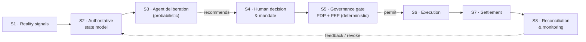

# Case Study — Mossland Repositories mapped to the SDE Reference Loop

*A working crosswalk from stated repository roles to the Open-SDE reference loop and the SDE-0 minimum conformance profile — one implementer's map, read against a deliberately neutral reference model.*

*Last updated: July 2026 · Part of the [Open-SDE](../../README.md) research initiative.*

> **Maturity: Draft.** This document is an early working map, not a settled result.

---

## What this document is — and is not

Open-SDE is a **general, cross-domain reference model** for assured bounded
autonomy: it specifies *who grants a software agent authority, how that authority
is bounded and revoked, and how probabilistic AI judgment is kept separate from
deterministic authorization, execution, settlement, and accountability.* It is
token-, chain-, and product-neutral, and it is not itself an agent framework or a
payment implementation.

This case study takes one family of implementations — the **Mossland** open-dev
repositories — and lays them against that reference model so the abstract loop
has a concrete anchor. Two disclaimers govern everything below:

1. **This is a working map from *stated* roles, not code inspection.** The roles
   and repository URLs used here were provided by the maintainer. Nothing in this
   document has been verified against the repositories' actual source, tests, or
   deployed behaviour. Treat every mapping as a hypothesis to be checked, not a
   conformance claim. Where a repository's maturity was not stated, it is marked
   **unknown**.
2. **Open-SDE stays neutral.** Mossland is *one* case study, included because
   Open-SDE was initiated by Mossland Lab and its repositories are conveniently
   legible. The reference model's definitions do not depend on any Mossland
   repository, and inclusion here is not an endorsement, a certification, or a
   statement that any repository is SDE-0 conformant.

---

## The reference loop and the separation principle

The Open-SDE reference loop is the minimum unit of a software-defined economy.
For this crosswalk it is read in the fuller form that the reframe makes explicit —
a probabilistic front half feeding a deterministic back half, closed by
reconciliation:

The load-bearing idea is the **separation of probabilistic reasoning from
deterministic control**. Reasoning, intent formation, and orchestration (S3) may
be probabilistic; authorization, enforcement, execution, and settlement (S5–S7)
must be deterministic and auditable. This mirrors the three-layer framework in the
IMF's April 2026 note *How Agentic AI Will Reshape Payments*, which concentrates
adaptive reasoning in an upstream intent/orchestration layer while keeping the
authorization/control and settlement layers strictly deterministic
([IMF Note 2026/004, published 22 April 2026](https://www.imf.org/en/publications/imf-notes/issues/2026/04/22/how-agentic-ai-will-reshape-payments-575560)).
The governance gate itself (S5) is split into a **Policy Decision Point (PDP)**
that decides and a **Policy Enforcement Point (PEP)** that enforces — the split
standardized by the OpenID **AuthZEN Authorization API 1.0**, a Final OpenID
specification dated 11 January 2026
([openid.net](https://openid.net/specs/authorization-api-1_0.html)). The safety
monitor that bounds an untrusted complex function and reverts to a verified-safe
mode (part of S5/S8) is inherited runtime-assurance practice, codified in
[ASTM F3269-21](https://store.astm.org/f3269-21.html), not a Mossland invention.

Stated as a rule for reading the table below: **AI recommends, humans decide.**
Deliberation and orchestration repositories carry **no economic execution
authority**; they produce recommendations. Policy- and decision-record
repositories capture *who authorized what* and remain **separate from the
execution gates** that enforce it.

### SDE-0 requirements (shorthand)

The [SDE-0 minimum conformance profile](../sde-0-conformance-profile.md) has seven
requirements. This document refers to them as **R1–R7**:

| ID | Requirement (abridged) |
| --- | --- |
| **R1** | Identifiable principal, owner/operator, and agent |
| **R2** | A mandate: scope, budget, duration, target, revocation conditions |
| **R3** | State inputs with provenance, timestamp, freshness, uncertainty |
| **R4** | A PDP/PEP independent of the AI (decision + enforcement outside the model) |
| **R5** | Execution with idempotency, rate limits, budget caps, safe fallback |
| **R6** | Reconciliation of the execution receipt against the observed outcome |
| **R7** | Continuous monitoring, incident logging, recovery, human override |

---

## Crosswalk table

Loop stages are cited as **S1–S8** from the diagram above. "Maturity" is the
maintainer's stated maturity, or **unknown** where none was provided. Only the
repositories with maintainer-provided URLs are linked; the others are referenced
by name only, and no URLs have been invented for them.

| Repository | Stated role | Loop stage(s) touched | SDE-0 requirement(s) exercised | Maturity |
| --- | --- | --- | --- | --- |
| [**MosslandAI**](https://github.com/MosslandOpenDevs/MosslandAI) | Study repository for individual topics: agent identity, payments, verifiable AI, DePIN, etc. | S1–S8 (topic studies span the loop; not an integrated system) | R1 (identity), R2 (payments/mandates), R3 (verifiable AI), R6 (verifiable-AI reconciliation) — **as study topics, not implemented controls** | unknown |
| **open-sde** *(this repo)* | Cross-domain general structure: authority, safety, evaluation criteria | Defines all stages S1–S8; implements none | Defines R1–R7; asserts conformance for none | Draft (research frame) |
| [**open-sdb**](https://github.com/MosslandOpenDevs/open-sdb) | Building / BIM / BEM / BMS / Physical-AI domain cases | S1–S2 (physical signals → **Digital Twin**, the physical-domain specialization of the authoritative state model), S6 (physical execution) | R3 (physical state provenance/freshness), R5 (safe fallback for physical actuation), R7 (monitoring of deployed physical systems) | unknown |
| [**MossCoinForMachine**](https://github.com/MosslandOpenDevs/MossCoinForMachine) | Machine payments, MOC, x402 / AP2, settlement research | S7 (settlement), edge of S5 (authorization-to-pay) | R2 (spend budget/scope in mandates), R5 (budget caps, idempotent payment), R6 (settlement receipt vs. observed outcome) | unknown |
| [**BRIDGE 2026**](https://github.com/MosslandOpenDevs/bridge-2026) | A Mossland PoC of signal → deliberation → human decision → execution → outcome verification | S1 → S3 → S4 → S6 → S8 end-to-end (a full-loop proof of concept) | R3, R4 (human/gate decision), R5, R6 (outcome verification), R7 — exercised end-to-end at PoC depth | Stated PoC |
| **agentic-orchestrator** | Signal collection, agent planning, deliberation experiments — **no economic execution authority** | S1–S3 only (probabilistic front half) | R3 (state intake) — produces recommendations that *feed* R4; **exercises no authorization or execution requirement** | unknown |
| **Algora** | Deliberation experiments — **no economic execution authority** | S3 only (probabilistic deliberation) | Feeds R4 as input; **exercises no authorization or execution requirement** | unknown |
| **MossDAO** | Source of policy and human-decision records; **separated from physical/financial execution gates** | S4 (records human decisions / authority-granting), policy input to S5 | R1 (principal/authority provenance), R2 (mandate origin) — as *records*, not as the enforcing gate | unknown |
| **Agora** | Source of policy and human-decision records; **separated from physical/financial execution gates** | S4 (deliberative/policy records), policy input to S5 | R2 (policy that shapes mandates), R7 (human-override/exception record) — as *records*, not as the enforcing gate | unknown |

---

## Reading the map against the separation principle

Three observations follow directly from the table, and they are the reason the
crosswalk is worth drawing at all.

**1. The probabilistic front half is walled off from execution.**
`agentic-orchestrator`, `Algora`, and the deliberation side of `MosslandAI` sit in
stages S1–S3. Per their stated roles they hold **no economic execution
authority**: their output is a recommendation that must cross a human decision
(S4) and a deterministic PDP/PEP gate (S5) before anything happens. This is the
concrete form of *AI recommends, humans decide*, and it is exactly the
probabilistic/deterministic split the IMF note argues payment infrastructure
requires
([IMF Note 2026/004](https://www.imf.org/en/publications/imf-notes/issues/2026/04/22/how-agentic-ai-will-reshape-payments-575560)).
If a future code review found an orchestration repository able to move value or
actuate hardware directly, that would be an SDE-0 **R4 violation**, not a feature.

**2. Policy and decision records are separated from the gate that enforces them.**
`MossDAO` and `Agora` are described as sources of *policy and human-decision
records* — the origin of authority (R1) and of mandates (R2) — explicitly
**separated from the physical and financial execution gates**. In AuthZEN terms
they supply inputs a PDP evaluates; they are not themselves the PEP that
intercepts and permits or blocks an action
([AuthZEN Authorization API 1.0](https://openid.net/specs/authorization-api-1_0.html)).
Keeping the record of *who decided* distinct from the runtime that *enforces the
decision* is what makes after-the-fact accountability possible; collapsing them
would remove the audit boundary.

**3. The deterministic back half and reconciliation are where conformance is won
or lost.** `MossCoinForMachine` (settlement, S7) and the outcome-verification
stage of `BRIDGE 2026` (S8) are where **transaction success must be distinguished
from real-world outcome success** — the reconciliation requirement (R6). A
settled payment or a returned "200 OK" is an execution receipt, not proof that the
intended real action occurred; R6 exists precisely to force that comparison. This
is also where inherited runtime-assurance practice applies: a verified monitor
bounds the complex function and can revert to a safe fallback (R5), following the
pattern codified in [ASTM F3269-21](https://store.astm.org/f3269-21.html).

**On `MossCoinForMachine` and settlement standards.** Its stated scope references
x402 and AP2 as settlement/authorization research. Note that some of the
surrounding on-chain agent-identity substrate — for example
[ERC-8004 "Trustless Agents"](https://eips.ethereum.org/EIPS/eip-8004) — remains a
**Draft** Ethereum proposal (created 13 August 2025, still Draft as of mid-2026)
even though reference registries have been deployed to mainnet. Any mapping that
leans on such substrate for R1 (identity) or R2 (mandate) should treat the wire
formats as unstable, not settled.

---

## Caveats and open questions

- **No code was inspected.** Every cell above is derived from a stated role. The
  first useful follow-up is a per-repository audit that checks each claimed
  requirement (R1–R7) against actual behaviour, and replaces "unknown" maturity
  with an evidenced label.
- **"Touches a stage" ≠ "satisfies the requirement."** A repository can operate in
  a loop stage without meeting the SDE-0 requirement associated with it. The table
  records *exercise*, not *conformance*.
- **The loop is drawn cleanly; real systems leak.** In practice, deliberation,
  authorization, and execution concerns tend to bleed across repository
  boundaries. The value of the crosswalk is that it makes such leakage — an
  orchestrator with execution rights, a DAO record wired directly into a gate —
  *visible* as a departure from the separation principle.
- **Neutrality is a standing constraint.** If this crosswalk ever reads as a
  Mossland scorecard rather than a worked example, it has drifted from Open-SDE's
  purpose. The reference model must remain usable, unchanged, for any other
  implementer's repositories.

---

## Related

- [SDE-0 Minimum Conformance Profile](../sde-0-conformance-profile.md) — the R1–R7 requirements applied above.
- [Authority and Safety Model](../authority-and-safety-model.md) — the separation principle, PDP/PEP, runtime assurance, and the eight non-claims.
- [Reference Architecture](../reference-architecture.md) — the loop (S1–S8) expanded into a concrete architecture.
- [Working Definition and Scope](../working-definition-and-scope.md) — what a software-defined economy is, and what this repository is not.
- [Landscape 2026](../landscape-2026.md) — dated survey of what is actually shipping across the loop.

See [references.md](../references.md) for the full, annotated source list.
