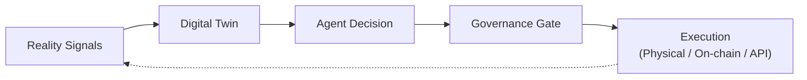

# SDE Concepts, Primitives, and Vocabulary

*Defining the Software-Defined Economy precisely, mapping it onto the vocabulary the rest of the industry actually uses, and cataloguing the executable primitives that make the reference loop real.*

*Last updated: July 2026 · Part of the [Open-SDE](../README.md) research initiative.*

---

## 1. What the Software-Defined Economy is

A **[Software-Defined Economy (SDE)](#glossary)** is defined in Open-SDE as follows:

> A Software-Defined Economy is a socio-technical system in which software agents, operating under delegated authority, allocate scarce resources or initiate state-changing actions through explicit policy, authorization, execution, settlement, and accountability controls.

"Software-Defined Economy" is Open-SDE's own **working term**, not an established industry-standard label (the fuller treatment is in [working-definition-and-scope.md](./working-definition-and-scope.md), and the adjacent industry vocabulary is surveyed in [§2](#2-positioning-software-defined-economy-and-its-louder-cousins)). The definition is deliberately narrow, and it turns on *bounded delegation* rather than raw autonomy. It is not "the economy has a lot of software in it" (true since the 1990s) but a specific claim about **who grants an agent authority, how that authority is bounded and revoked, and how probabilistic AI judgment is separated from deterministic execution, settlement, and accountability.** Four properties make it concrete:

- economic **rules** are expressed as policy that is traceable into executable constraints — complementing, never replacing, law and organizational responsibility;
- **decisions** — intent, reasoning, orchestration — may be delegated to AI agents, while authorization, control, and settlement stay deterministic and auditable. The IMF's April 2026 note on agentic payments makes the same split its central design principle: keep probabilistic reasoning upstream and the authorization/control and settlement layers strictly deterministic ([IMF Note 2026/004](https://www.imf.org/en/publications/imf-notes/issues/2026/04/22/how-agentic-ai-will-reshape-payments-575560));
- **execution** happens through code, APIs, and protocols against real-world or on-chain state; and
- **governance** is applied at a decision-and-enforcement gate — policy engines, scoped credentials, mandates, and kill switches — with humans setting authority and budgets, monitoring, and retaining revocation and override.

Humans are not removed from the loop. Their role shifts from approving each individual action to **granting and bounding authority, monitoring, and handling exceptions** — AI recommends, humans decide the envelope. The unit that carries this claim is the **[SDE reference loop](#glossary)** — Reality Signals → Digital Twin → Agent Decision → Governance Gate → Execution — which the [reference-architecture](./reference-architecture.md) doc expands node by node. The authority, safety, and reconciliation mechanics that make the delegation *assured* rather than merely *automated* are developed in [authority-and-safety-model.md](./authority-and-safety-model.md).

This document defines the vocabulary and enumerates the primitives that instantiate the two middle-to-late nodes — **Agent Decision** and **Governance Gate** — which, as of mid-2026, are the stages that moved furthest from demo to production. The evidence for that transition is surveyed in [landscape-2026.md](./landscape-2026.md); here the emphasis is conceptual.

---

## 2. Positioning: "Software-Defined Economy" and its louder cousins

The honest starting point is that **the literal term "Software-Defined Economy" is niche.** Its most-cited articulation is an older cloud-infrastructure framing from OpenStack (circa 2014), which used it to describe software enabling "constant change and choice" in IT provisioning ([OpenStack](https://www.openstack.org/blog/openstack-taking-its-place-in-the-software-defined-economy/)). The concept Open-SDE cares about is real and rapidly acquiring infrastructure, but the *phrase* is not the industry's chosen label. Mainstream 2025–2026 thought leadership consolidated around a handful of adjacent framings that describe the same phenomenon from different vantage points:

| Vantage | Term | Who uses it | What it foregrounds |
| --- | --- | --- | --- |
| Venture / infra | **Agentic economy** | a16z, Stripe, Circle, Coinbase | Agents as first-class actors; "building for agents, not humans" |
| Analyst | **Programmable economy** / **machine customers** / **autonomous business** | Gartner | Non-human buyers and software-executed business processes at population scale |
| Consultancy / policy | **Agent economy** / **agentic commerce** | McKinsey, World Economic Forum | Market sizing and trusted-adoption governance |

In December 2025, a16z's *Big Ideas 2026* framed the year around agent-native infrastructure and argued the binding constraint is shifting "from intelligence to identity" ([a16z](https://a16z.com/newsletter/big-ideas-2026-part-1/)). Gartner's "programmable economy" and "machine customers" are the most direct analyst-side synonyms for the SDE thesis: it projects machine customers will influence or participate in roughly **$30 trillion** of purchases by 2030 ([Gartner](https://www.gartner.com/en/newsroom/press-releases/2025-09-10-gartner-unveils-top-emerging-technologies-to-support-autonomous-business)). McKinsey sizes AI-agent-mediated consumer commerce at **$3–5 trillion** globally by 2030, conditional on catalogs and policies becoming machine-readable ([McKinsey](https://www.mckinsey.com/capabilities/quantumblack/our-insights/the-automation-curve-in-agentic-commerce)).

**Open-SDE's position.** These are not rival theories to be adjudicated; they are the working vocabulary. This repository adopts the mainstream "agentic / programmable economy" language wherever it aids communication, while keeping two distinctive emphases that the popular labels tend to underweight: **reality-anchored execution** (the loop must close against physical and on-chain state, not just chat interfaces — see [reality-anchored-execution.md](./reality-anchored-execution.md)) and **governance as code** (constraints enforced at the gate, not documented in a policy PDF — see [governance-as-code.md](./governance-as-code.md)).

---

## 3. Primitives of the Agent-Decision stage: the harness

The Agent-Decision node is no longer "a call to a model API." Through 2026 the production agent SDKs converged on shipping an **[agent harness](#glossary)** — the runtime layer wrapping a model that handles context compaction, memory, file and tool access, sandboxed execution, and middleware — so that an agent can work a long task without exhausting its context window. Microsoft's Agent Framework reached 1.0 GA in early April 2026, unifying AutoGen and Semantic Kernel with native MCP and A2A support ([Microsoft](https://learn.microsoft.com/en-us/agent-framework/overview/)); at Build 2026 Microsoft added the harness itself, session-isolated hosted agents, and **[CodeAct](#glossary)**, in which an agent collapses a multi-step plan into a single sandboxed program run in an isolated micro-VM ([Microsoft DevBlogs](https://devblogs.microsoft.com/agent-framework/microsoft-agent-framework-at-build-2026-announce/)). CodeAct is worth isolating conceptually: it is *"decisions as executable code,"* the core SDE premise, pushed into the agent's own action layer.

The pattern is not vendor-specific. OpenAI shipped a model-native sandboxed harness for long-horizon tasks with declarative guardrails in April 2026 ([OpenAI](https://openai.com/index/the-next-evolution-of-the-agents-sdk/)), and Anthropic's Claude Agent SDK now underpins hosted Managed Agents with scheduling, a memory-curating "dreaming" pass, and outcomes-based grading ([Anthropic](https://claude.com/blog/new-in-claude-managed-agents)). How much of a workflow an agent can own is commonly proxied by the **[time horizon](#glossary)** metric: METR's benchmark (updated May 8, 2026) places frontier 50%-reliability horizons in the multi-hour range, with the historical doubling *reportedly* compressing — though METR flags measurements above 16 hours as unreliable on its current suite, and does not publish a precise doubling figure ([METR](https://metr.org/time-horizons/)). We treat the longer, headline horizon numbers as directional, not settled.

---

## 4. Primitives of the Governance Gate

The **[governance gate](#glossary)** is the checkpoint between an agent's decision and real-world execution where executable constraints permit, block, or escalate the action. This is the conceptual center of Open-SDE, and in 2026 it stopped being an abstraction: a set of concrete, shipping primitives now instantiate it. They fall into three families — **scoped payment authority**, **agent identity and authorization**, and **runtime enforcement**.

### 4.1 Scoped, cryptographic payment authority

The recurring design across every serious agentic-payments effort is the same: bind an agent's spending power to an exact, revocable scope, expressed as a signed artifact the execution layer must satisfy before value moves.

| Primitive | Origin | What it scopes | Status |
| --- | --- | --- | --- |
| **[Shared Payment Token (SPT)](#glossary)** | Agentic Commerce Protocol (OpenAI + Stripe) | One merchant, one exact cart total, without exposing card credentials | Shipping (ChatGPT Instant Checkout) |
| **[Mandate](#glossary)** | AP2 (Google → FIDO Alliance) | User intent, scope, and spend limits, carried as a W3C Verifiable Credential | Shipping (v0.2) |
| **Agentic Token** | Mastercard Agent Pay for Machines | Agent identity + consent policy + step-up rules, recorded on-chain | Shipping |
| **[Agentic wallet](#glossary)** | Coinbase, Circle | Session caps, spend limits, policy guardrails encoded into the wallet | Shipping |
| **[Nanopayments](#glossary)** | Circle (via Gateway) | Gas-free USDC transfers as small as ~$0.000001 for high-frequency M2M flows | Shipping |

The SPT is the cleanest illustration: an agent's execution power is cryptographically bounded to one merchant and one cart total, so a hijacked or mistaken agent cannot spend outside that envelope ([Stripe](https://stripe.com/newsroom/news/stripe-openai-instant-checkout)). AP2's Mandates generalize the idea into a tamper-proof per-transaction audit trail ([Google](https://blog.google/products-and-platforms/platforms/google-pay/agent-payments-protocol-fido-alliance/)), and Mastercard's Agentic Tokens invert the assumption of card tokenization — instead of assuming a present human, they assume a pre-authorized agent and record its permissions on Polygon, Solana, and Base ([Mastercard](https://www.mastercard.com/us/en/news-and-trends/press/2026/june/mastercard-launches-agent-pay-for-machines.html)). Coinbase's Agentic Wallets encode the same guardrails at the wallet layer ([Coinbase](https://www.coinbase.com/developer-platform/discover/launches/agentic-wallets)), and Circle's gas-free nanopayments extend the pattern to sub-cent machine-to-machine settlement, with USDC transfers as small as ~$0.000001 ([Circle](https://www.circle.com/pressroom/circle-launches-ai-infrastructure-to-power-the-agentic-economy)). The conceptual constant across all of them: **consent and spend rules become executable, auditable constraints rather than trust in the agent's reasoning.**

### 4.2 Agent identity and authorization

You cannot enforce constraints, attribute actions, or assign liability without durable, revocable machine identities — so identity emerged as the prerequisite substrate for the gate, not a separate concern.

- **[Know Your Agent (KYA)](#glossary)** — cryptographically signed credentials binding an agent to its principal, its permitted constraints, and its liability; the agent analog of KYC. Proposed by a16z as an identity primitive ([a16z](https://a16z.com/newsletter/big-ideas-2026-part-1/)) and implemented by Skyfire, which pairs KYA with USDC settlement (KYAPay) ([Skyfire/Businesswire](https://www.businesswire.com/news/home/20251218520399/en/Skyfire-Demonstrates-Secure-Agentic-Commerce-Purchase-Using-the-KYAPay-Protocol-and-Visa-Intelligent-Commerce)).
- **[Agent Capability and Authorization Profile (ACAP)](#glossary)** — a WEF/Capgemini deployment-level instrument (May 2026) documenting, in one auditable record, an agent's delegated power: permitted actions, contexts, required conditions, and assigned oversight ([WEF](https://www.weforum.org/publications/ai-agents-in-action-a-playbook-for-trusted-adoption-authorization-and-scaling/)).
- **[ERC-8004 (Trustless Agents)](#glossary)** — three on-chain registries (Identity, Reputation, Validation) giving agents ERC-721 identities for cross-organizational discovery without prior trust. Reference registries deployed to Ethereum mainnet in early 2026, but the specification itself remains **Draft** (created August 2025, still Draft as of mid-2026), so its wire format and registry semantics should be treated as unfinished ([ERC-8004](https://eips.ethereum.org/EIPS/eip-8004)).
- **Microsoft Entra Agent ID** — managing agents as first-class, credentialed, revocable enterprise identities; *reportedly* reached general availability in 2026 ([Microsoft](https://learn.microsoft.com/en-us/entra/agent-id/whats-new-agent-id)).

KYA, ACAP, and ERC-8004 approach the same problem from three altitudes — credential, deployment profile, and decentralized registry — and none has yet consolidated into a single standard. That non-consolidation is itself a research finding, carried into [ROADMAP.md](../ROADMAP.md).

### 4.3 Runtime enforcement

The third family is where governance becomes literally executable: policy engines that intercept an agent's action *before* it touches an upstream system. Microsoft open-sourced an MIT-licensed Agent Governance Toolkit (April 2, 2026) whose Agent OS intercepts every action at sub-millisecond latency, with CPU-style **[execution rings and a kill switch](#glossary)** ([Microsoft](https://opensource.microsoft.com/blog/2026/04/02/introducing-the-agent-governance-toolkit-open-source-runtime-security-for-ai-agents/)). In parallel, an emerging recommended pattern enforces **[Open Policy Agent (OPA)](#glossary)** at the tool-calling / MCP-gateway layer, so the policy engine — not the agent — decides what is permitted, and a hijacked agent is blocked before reaching upstream systems. Human-in-the-loop is being encoded into the transport itself: the MCP 2026-07-28 release candidate standardizes confirmation for high-risk actions via Multi Round-Trip Requests ([MCP](https://blog.modelcontextprotocol.io/posts/2026-07-28-release-candidate/)). This runtime layer is treated in depth in [governance-as-code.md](./governance-as-code.md); the threat it answers — chiefly **[Agent Goal Hijack (OWASP ASI01)](#glossary)** — is why the gate must be enforced at the boundary rather than by trusting the agent's own reasoning.

---

## 5. The core conceptual discipline: infrastructure ≠ activity

The single most important habit this repository asks of its contributors is to **distinguish deployed infrastructure from realized economic activity.** The rails, primitives, and standards catalogued above largely exist; the volume of genuine, non-synthetic economic activity flowing through them is still early. Overstating how "software-defined" the economy already is is the characteristic error of the agentic-economy discourse, and Open-SDE exists partly to resist it.

The evidence cuts both ways and must be held together:

- **Real but small.** A Keyrock analysis (via CoinDesk) found agents settled roughly **176 million on-chain transactions worth over $73 million** between May 2025 and April 2026, with **98.6% in USDC** and about 76% of payments below the ~30-cent card-fee floor ([CoinDesk](https://www.coindesk.com/business/2026/05/21/crypto-rails-are-becoming-the-default-payment-layer-for-ai-agents-report-says)). This is the strongest hard measurement that the loop operates at all — and it is modest in absolute terms.
- **Thin organic demand.** Despite an ecosystem valued near $7B, on-chain analysis reportedly showed the x402 protocol processing only about **$28,000 in daily volume** in early 2026, with roughly half of transactions artificial ([CoinDesk](https://www.coindesk.com/markets/2026/03/11/coinbase-backed-ai-payments-protocol-wants-to-fix-micropayment-but-demand-is-just-not-there-yet)).
- **Pilots that don't scale.** Secondary industry trackers report that roughly **88–89% of enterprise agent pilots** fail to reach production; Gartner separately forecasts that over 40% of agentic AI projects will be canceled by 2027 over cost, unclear ROI, and weak risk controls ([Gartner](https://www.gartner.com/en/newsroom/press-releases/2025-08-26-gartner-predicts-40-percent-of-enterprise-apps-will-feature-task-specific-ai-agents-by-2026-up-from-less-than-5-percent-in-2025)). The binding constraint is governance, cost control, and reliable execution — not raw model capability, which is precisely the gate this repository studies.

The corollary is a taxonomy this repo applies to every claim: **shipping / real**, **early**, or **speculative**. A payment protocol adopted by a neutral standards body with named production users is *shipping*; a machine-to-machine settlement demonstrated only in simulation (for example, the peaq/Serve Robotics on-chain delivery payment) is *early*; a fully autonomous physical or financial system with certified governance is, as of mid-2026, *speculative*. Contributors should label maturity explicitly and hedge partly-confirmed claims ("reportedly," "as of this writing") rather than flatten them into confident prose.

---

## 6. Related

- [working-definition-and-scope.md](./working-definition-and-scope.md) — the canonical definition, what is in and out of scope, and the eight non-claims in full.
- [authority-and-safety-model.md](./authority-and-safety-model.md) — delegated authority and mandates, the PDP/PEP gate, runtime assurance, and reconciliation developed in depth.
- [landscape-2026.md](./landscape-2026.md) — the dated, cited survey of what is actually shipping mid-2026, organized by the loop.
- [reference-architecture.md](./reference-architecture.md) — the five-stage loop expanded into a concrete architecture, with worked end-to-end examples.
- [agent-native-economy.md](./agent-native-economy.md) — the Agent-Decision node in depth (harnesses, identity, A2A, the pilot-to-production gap).
- [governance-as-code.md](./governance-as-code.md) — the Governance-Gate node: policy engines, authorization standards, and the regulatory layer.
- [reality-anchored-execution.md](./reality-anchored-execution.md) — digital twins, embodied agents, and DePIN.
- [ROADMAP.md](../ROADMAP.md) — the open questions these definitions surface.

---

## Glossary

Definitions used consistently across the Open-SDE docs. On first meaningful use, other documents link back to this section as `concepts.md#glossary`.

- **Software-Defined Economy (SDE).** A socio-technical system in which software agents, operating under delegated authority, allocate scarce resources or initiate state-changing actions through explicit policy, authorization, execution, settlement, and accountability controls. "Software-Defined Economy" is Open-SDE's working term, not an established standard label; mainstream discourse uses "agentic economy" and "programmable economy" for the adjacent phenomenon.
- **SDE reference loop.** The minimum unit of an SDE: Reality Signals → Digital Twin → Agent Decision → Governance Gate → Execution (physical, on-chain, or API).
- **Governance gate.** The checkpoint between an agent's decision and real-world execution where executable constraints (policy engines, approval chains, kill switches, mandates, scoped tokens) permit, block, or escalate the action. Architecturally it splits into a **Policy Decision Point** and a **Policy Enforcement Point** (see below).
- **Assured bounded autonomy.** Open-SDE's organizing principle: an agent's reasoning may be probabilistic, but its authority is explicitly granted, bounded, monitored, and revocable, and its authorization, control, and settlement are kept deterministic and auditable. The term is inherited from safety engineering rather than coined here — it names the shift from asking "can the agent act?" to specifying who bounds it and how. Developed in [authority-and-safety-model.md](./authority-and-safety-model.md).
- **Delegated authority / Mandate.** The authority an owner/operator grants to an agent, expressed as a machine-checkable **mandate** stating scope, budget, duration, target, and revocation conditions; the agent may act only within it. This is the general SDE concept; AP2's "Mandate" (below) is one concrete verifiable-credential encoding of it. Software agents in an SDE are actors *under delegated authority*, not first-class economic actors.
- **Policy Decision Point (PDP).** The component that evaluates a request against policy and returns an allow / deny / obligation decision, independent of the AI that made the request. The PDP/PEP separation originates in the ABAC/XACML tradition; the API *between* a PDP and a PEP was standardized by the OpenID **AuthZEN Authorization API 1.0**, approved as an OpenID Final Specification in January 2026 ([OpenID AuthZEN](https://openid.net/specs/authorization-api-1_0.html)).
- **Policy Enforcement Point (PEP).** The component that intercepts an action and enforces the PDP's decision at the boundary — before the action reaches an upstream system — without itself deciding policy. In AuthZEN terms the PEP is the API client that asks the PDP for a decision ([OpenID AuthZEN](https://openid.net/specs/authorization-api-1_0.html)).
- **Runtime assurance (RTA).** An established safety-engineering pattern in which a trusted, verified safety monitor bounds an untrusted or complex (e.g. AI) function and reverts to a verified-safe mode when a violation is imminent. It originates in Lui Sha's Simplex Architecture and DARPA's Assured Autonomy program, and is codified for complex/AI functions by ASTM F3269-21 (2021), "Standard Practice for Methods to Safely Bound Behavior of Aircraft Systems Containing Complex Functions Using Run-Time Assurance" ([ASTM F3269-21](https://store.astm.org/f3269-21.html)). Open-SDE inherits it rather than inventing it.
- **Reconciliation.** The discipline of treating transaction/execution success as *distinct* from real-world outcome success: comparing the execution receipt against the observed real-world outcome and resolving any gap. A signed receipt or a confirmed on-chain transaction is evidence that a step ran, not proof that the intended effect occurred.
- **Authoritative State Model.** The general term for the state an agent reasons over, carrying provenance, timestamp, freshness, and uncertainty. The **Digital Twin** (below) is its physical-domain specialization; in digital-commerce or API domains the authoritative state is a catalog, ledger, or account model rather than a twin, so "Digital Twin" should not be forced onto those domains.
- **Agent harness.** The runtime layer wrapping a model that handles context compaction, memory, file/tool access, sandboxed execution, and middleware so an agent can work on long tasks without exhausting its context window. Now standard in Microsoft Agent Framework, OpenAI's Agents SDK, and the Claude Agent SDK.
- **CodeAct.** An action paradigm where a model emits a single consolidated program (e.g. Python) to accomplish a multi-step task instead of many sequential tool calls, cutting latency and token cost; in Microsoft Agent Framework the code runs in an isolated micro-VM.
- **Time horizon (METR).** The length of task (measured as the time a human expert would take) a model can complete at a given reliability, e.g. a 50%-reliability horizon; a proxy for how much of a multi-step workflow an agent can autonomously own. METR flags measurements above 16 hours as unreliable on its current suite.
- **A2A (Agent2Agent) protocol.** An open, vendor-neutral protocol (donated to the Linux Foundation in 2025, first stable v1.0 in 2026) for autonomous agents to discover, authenticate to, and delegate tasks to one another across organizations, using cryptographically signed Agent Cards for trust.
- **MCP (Model Context Protocol).** An Anthropic-originated open protocol standardizing how agents connect to tools and data; its 2026-07-28 release candidate adds a stateless core, Extensions, Tasks, hardened OAuth 2.1/OIDC authorization, and standardized human-in-the-loop via Multi Round-Trip Requests.
- **Agent identity.** Treating AI agents as first-class, credentialed, revocable identities so their actions can be authenticated, authorized, attributed, and audited like human or service accounts (e.g. Microsoft Entra Agent ID, ERC-8004, Skyfire KYA).
- **ERC-8004 (Trustless Agents).** An Ethereum proposal defining three on-chain registries (Identity, Reputation, Validation) giving agents ERC-721 identities, reputation signals, and optional validation for cross-organizational discovery without prior trust. **Status: Draft** (Standards Track, Category ERC; created August 2025, still Draft as of mid-2026) — reference Identity/Reputation/Validation registries were deployed to Ethereum mainnet in early 2026, but the specification is not finalized, so it should be cited as an emerging proposal, not a settled standard.
- **Know Your Agent (KYA).** An identity primitive (Skyfire's framework, a16z's proposal) of cryptographically signed credentials binding an agent to its principal, its permitted constraints, and its liability — the agent analog of KYC.
- **Mandate (AP2).** A cryptographically signed digital contract in Google's Agent Payments Protocol (carried as a W3C Verifiable Credential) encoding a user's intent, scope, and spend limits, forming a tamper-proof per-transaction audit trail.
- **Shared Payment Token (SPT).** A payment primitive from the Agentic Commerce Protocol (Stripe/OpenAI, also used by MPP) letting an agent initiate a payment scoped to a specific merchant and exact cart total without exposing the buyer's underlying card credentials.
- **x402.** An open protocol (Coinbase/Cloudflare, now a Linux Foundation project as of April 2, 2026) that uses the HTTP 402 "Payment Required" status to trigger instant stablecoin (USDC) payments over HTTP, enabling pay-per-request APIs and agent micropayments.
- **Machine Payments Protocol (MPP).** An open HTTP-402-based agent-payment standard from Stripe and Tempo/Paradigm (March 2026) supporting microtransactions and recurring payments across cards, BNPL, and stablecoins, with a "sessions" primitive (OAuth-for-money spend caps) for streaming micropayments.
- **Agentic Commerce Protocol (ACP).** An open standard co-developed by OpenAI and Stripe (Apache 2.0, Sept 2025) for agent-initiated checkout connecting buyers, their agents, and businesses; payment-provider-agnostic and used to power ChatGPT Instant Checkout.
- **Agentic wallet.** Wallet infrastructure built for autonomous agents (MPC or self-custodial) with encoded guardrails — spend limits, session caps, policy controls — so agents transact within bounded authority (e.g. Coinbase Agentic Wallets, Circle Agent Wallets).
- **Nanopayments.** Circle's gas-free USDC transfer capability (via Circle Gateway) supporting amounts as small as ~$0.000001, designed to make high-frequency machine-to-machine settlement economically viable.
- **Policy-as-Code (PaC) / Open Policy Agent (OPA).** Governance rules expressed as machine-executable code (e.g. Rego) evaluated automatically at decision or execution time; OPA is increasingly deployed at API/MCP gateways to allow/deny agent tool calls before they reach upstream systems.
- **Agent Goal Hijack (OWASP ASI01).** The top agentic-security risk: attackers embed hidden instructions in documents, emails, or RAG content to redirect an autonomous agent's objective and actions — prompt injection evolved for tool-using agents.
- **Agent Capability and Authorization Profile (ACAP).** A WEF/Capgemini deployment-level governance instrument (May 2026) documenting an agent's delegated power — permitted actions, contexts, required conditions, and oversight — in a single auditable record before and while it operates.
- **Execution rings / kill switch.** Runtime containment primitives (from Microsoft's Agent Governance Toolkit) modeled on CPU privilege levels plus emergency termination, letting operators bound and instantly halt agent actions.
- **GPAI (General-Purpose AI model).** Under the EU AI Act, a broadly capable model (e.g. a large foundation model). Providers face transparency and copyright obligations (and, for systemic-risk models, safety obligations); Commission enforcement powers become exercisable from Aug 2, 2026.
- **Digital twin.** A continuously updated, physically accurate software replica of a real asset, facility, or system used to simulate, test, and optimize scenarios before changes are executed physically; the "Digital Twin" node of the SDE loop (e.g. NVIDIA Omniverse DSX).
- **Vision-Language-Action (VLA) model.** A robot foundation model mapping camera images plus a natural-language instruction directly to motor commands; the dominant 2026 approach to general-purpose embodied control (Gemini Robotics 1.5, pi-0.5, Isaac GR00T).
- **DePIN (Decentralized Physical Infrastructure Network).** Blockchain-coordinated networks where independently owned real-world hardware (GPUs, wireless, mapping cameras, sensors, storage) is provisioned as a token-incentivized service with usage settled on-chain — a software-defined market for physical infrastructure.
- **Machine customers (Gartner).** Non-human economic actors (agents, smart appliances, connected vehicles, IoT equipment) that purchase on behalf of people or organizations; Gartner projects they will influence or participate in ~$30T of purchases by 2030.
- **Tokenized Real-World Asset (RWA).** A blockchain token representing ownership or claims on an off-chain asset (Treasuries, money-market funds, credit, commodities), offering 24/7 settlement, programmable compliance, and composability with DeFi and agents; ex-stablecoin RWAs crossed ~$32B in May 2026.

---

See [references.md](./references.md) for the full, annotated source list.
