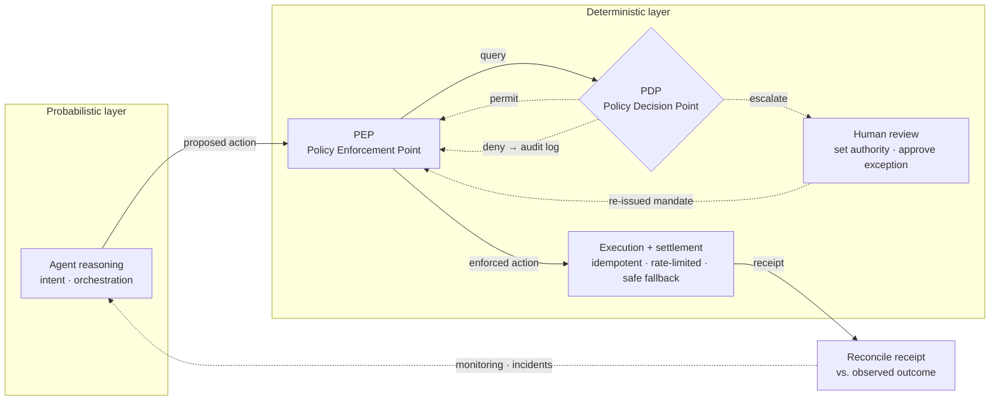

# Governance as Code: Policy-to-Code Traceability and the PDP/PEP Gate

*Research area 3 — where a software agent's proposed action, taken under delegated authority, meets a deterministic decision-and-enforcement gate before it can touch reality.*

*Last updated: July 2026 · Part of the [Open-SDE](../README.md) research initiative.*

> **Maturity: Draft.** Reviewed against primary sources in July 2026. This is a cross-domain reference model, not a standard or an implementation; it describes patterns and cites where each is Final, Draft, or still early.

---

## What "governance as code" does and does not mean

The phrase is easy to over-read, so state the boundary first. "Governance as code" here means **policy-to-code traceability**: the ability to trace an organizational or legal obligation to the machine-evaluated rule that enforces it, and to trace every agent action back to the policy that permitted it. It does **not** mean code *instead of* prose, and it does not mean that executable rules replace law, organizational responsibility, or functional-safety procedure. Code complements those; it never substitutes for them. A passing policy check is not a legal defense, an accountability transfer, or a safety certification — it is one enforced control among many. This is a standing non-claim of the reference model, stated in full in [authority-and-safety-model.md](./authority-and-safety-model.md).

With that boundary drawn, the useful claim is narrower and defensible: in 2026 the *enforcement* of governance moved from something humans read and apply after the fact toward something a deterministic runtime evaluates before an action executes. This document separates what is shipping from what is still early, states the approximate date and primary source for every non-obvious claim, and hedges the claims the fact-check left uncertain.

---

## Why this is the load-bearing node

In the [SDE reference loop](./concepts.md#glossary) — Reality Signals → Authoritative State Model → Agent Decision → Governance Gate → Execution — the [governance gate](./concepts.md#glossary) is the point at which a software agent's proposed action, taken under delegated authority, is permitted, blocked, or escalated by machine-evaluated rules *before* it settles a payment, changes an access grant, or moves a robot. The empirical case for treating this as the decisive node is blunt: roughly 88–89% of enterprise agent pilots still fail to reach production, and Gartner, in an [August 2025 forecast](https://www.gartner.com/en/newsroom/press-releases/2025-08-26-gartner-predicts-40-percent-of-enterprise-apps-will-feature-task-specific-ai-agents-by-2026-up-from-less-than-5-percent-in-2025), expects more than 40% of agentic-AI projects to be cancelled by 2027 over cost, unclear ROI, and weak risk controls. (The specific ~88–89% figure comes from secondary 2026 trackers, not the Gartner release.) The binding constraint on the software-defined economy is not raw model capability; it is **assured bounded autonomy** — who grants an agent its authority, how that authority is scoped, bounded, monitored, and revoked, and how the agent's probabilistic judgment is kept separate from deterministic execution and settlement.

The through-line of this document is a single architectural commitment: **separate the probabilistic from the deterministic, then split the gate that enforces the boundary into a decision point and an enforcement point.** What follows grounds that commitment in the primary sources that shipped in 2026.

---

## 1. Separate the probabilistic from the deterministic

An agent's reasoning, intent formation, and orchestration may be probabilistic — that is what a large model is good at. The controls around it must not be. This separation is not an Open-SDE invention; it is the central recommendation of the IMF's April 2026 note **[How Agentic AI Will Reshape Payments](https://www.imf.org/en/publications/imf-notes/issues/2026/04/22/how-agentic-ai-will-reshape-payments-575560)** (IMF Note No. 2026/004, published April 22, 2026), which proposes a three-layer framework for agentic payments:

1. **Intent formation and orchestration — probabilistic.** The agent interprets an objective and decomposes it into tasks. Adaptive, model-driven, non-deterministic.
2. **Authorization and control — deterministic.** Whether a proposed action is permitted is decided by explicit, auditable rules, not by the model.
3. **Settlement — deterministic, with legal finality.** The irreversible movement of value is rules-bound and predictable.

The IMF's framing is that core payment rails should stay "dumb" and deterministic while intelligence sits upstream. Generalized beyond payments, this is the load-bearing pattern of the reference model: concentrate adaptive reasoning in the agent, and keep authorization, control, execution, and settlement outside the model, where they can be verified, logged, and reconciled. The [reference architecture](./reference-architecture.md) places this boundary explicitly; here it is the reason the gate exists at all.

---

## 2. The gate is a decision point plus an enforcement point (PDP/PEP)

A single "gate" box hides the most important structure. In practice the gate is two roles that must be kept distinct:

- A **Policy Decision Point (PDP)** — evaluates a proposed action against policy and returns a verdict (permit, deny, escalate).
- A **Policy Enforcement Point (PEP)** — intercepts the action, asks the PDP for a verdict, and enforces it, without needing to know how the decision was reached.

The PDP/PEP split predates AI agents: it comes from the attribute-based access control (ABAC) and XACML tradition. What is new is that it now has a published, interoperable API standard. The OpenID Foundation approved the **[AuthZEN Authorization API 1.0](https://openid.net/specs/authorization-api-1_0.html)** as an OpenID **Final Specification** on January 12, 2026 (the specification document is dated January 11, 2026 and carries "Status: Final"). AuthZEN standardizes the request/response contract between a PEP and a PDP over a transport-agnostic JSON API, with Access Evaluation, Access Evaluations, and Search endpoints — letting a PEP ask a PDP for an access decision without either side knowing the other's internals. For the SDE this is exactly the standard the governance gate needs: policy is evaluated centrally at a decision point and enforced at distributed enforcement points, so authorization is externalized from the agent and interoperable across systems.

The enforcement half also inherits a mature safety-engineering pattern. Run-time assurance (RTA) — a **trusted, verified monitor that bounds an untrusted or complex function and reverts to a verified-safe mode when a violation is imminent** — originates in Lui Sha's Simplex Architecture and is codified for aviation in **[ASTM F3269-21](https://store.astm.org/f3269-21.html)**, "Standard Practice for Methods to Safely Bound Behavior of Aircraft Systems Containing Complex Functions Using Run-Time Assurance," and advanced by DARPA's Assured Autonomy program (launched 2018). A PEP that enforces a PDP verdict and falls back to a safe mode on violation is this pattern applied to software agents. It is inherited practice, not a novel mechanism — a point the reference model leans on rather than obscures.

### The gate, drawn



ASCII fallback, consistent with the README's loop:

```
Agent reasoning (probabilistic)
   ↓ proposed action
PEP  ──asks──►  PDP  ──►  [permit · deny → audit · escalate → human]
   ↓ (enforced)
Execution + settlement (deterministic: idempotent · rate-limited · safe fallback)
   ↓ receipt
Reconcile receipt vs. observed outcome  ──►  continuous monitoring ──► (back to agent)
```

---

## What is shipping vs. what is still early

| Layer of the gate | Status | Primary evidence |
|---|---|---|
| Standardized PDP/PEP authorization API | **Final specification** | OpenID AuthZEN Authorization API 1.0, [Jan 11–12, 2026](https://openid.net/specs/authorization-api-1_0.html) |
| Probabilistic/deterministic separation as institutional guidance | **Real / published** | IMF Note 2026/004, [Apr 22, 2026](https://www.imf.org/en/publications/imf-notes/issues/2026/04/22/how-agentic-ai-will-reshape-payments-575560) |
| Runtime policy engine (PEP) intercepting every action | **Real / shipping** | Microsoft Agent Governance Toolkit, [Apr 2, 2026](https://opensource.microsoft.com/blog/2026/04/02/introducing-the-agent-governance-toolkit-open-source-runtime-security-for-ai-agents/) |
| Policy-as-code at the tool/MCP-gateway layer | **Real, pattern consolidating** | OPA at the MCP gateway, [2026](https://codilime.com/blog/why-use-open-policy-agent-for-your-ai-agents/) *(reportedly)* |
| Human confirmation encoded in protocol | **Shipping as release candidate** | MCP 2026-07-28 RC, [Jul 2026](https://blog.modelcontextprotocol.io/posts/2026-07-28-release-candidate/) *(RC, not final)* |
| Codified adversarial threat model | **Real / published** | OWASP Top 10 for Agentic Applications, [Dec 9, 2025](https://genai.owasp.org/2025/12/09/owasp-top-10-for-agentic-applications-the-benchmark-for-agentic-security-in-the-age-of-autonomous-ai/) |
| Post-deployment monitoring taxonomy | **Final report** | NIST AI 800-4, six monitoring categories, [Mar 6, 2026](https://nvlpubs.nist.gov/nistpubs/ai/NIST.AI.800-4.pdf) |
| Agent identity + authorization standards effort | **Real, early** | NIST AI Agent Standards Initiative, [Feb 17, 2026](https://www.nist.gov/artificial-intelligence/ai-agent-standards-initiative) |
| Continuous assessment + meaningful human control | **Pre-standardization Focus Group** | ITU-T FG-TIDA, [announced Jul 9, 2026](https://www.itu.int/en/mediacentre/Pages/PR-2026-07-09-focus-group-agentic-AI.aspx) |
| Binding regulatory obligations on foundation models | **Live; enforcement pending** | EU AI Act GPAI, enforcement powers exercisable [Aug 2, 2026](https://artificialintelligenceact.eu/enforcement-of-chapter-v-under-the-eu-ai-act/) |
| Machine-checkable conformity standards a gate can consume | **Early / not yet ready** | Digital Omnibus deferrals, [Jun 29, 2026](https://www.consilium.europa.eu/en/press/press-releases/2026/06/29/artificial-intelligence-council-gives-final-green-light-to-simplify-and-streamline-rules/) |

---

## 3. The PEP became runtime infrastructure

### The enforcement point moves in front of the action

The clearest signal that governance is now enforced in code is Microsoft's **Agent Governance Toolkit**, open-sourced under an MIT license on [April 2, 2026](https://opensource.microsoft.com/blog/2026/04/02/introducing-the-agent-governance-toolkit-open-source-runtime-security-for-ai-agents/). Its core, *Agent OS*, is a stateless policy engine that intercepts every agent action *before* execution at sub-millisecond latency (reported <0.1 ms p99) — a PEP in the AuthZEN sense, sitting between the agent and the world. The companion *Agent Runtime* adds [execution rings](./concepts.md#glossary) modeled on CPU privilege levels, saga-style orchestration, and a kill switch, while an *Agent Compliance* package maps controls to the EU AI Act, HIPAA, and SOC 2. Microsoft describes it as the first toolkit to cover all ten OWASP Agentic risks and reports adapters into frameworks such as LangChain, CrewAI, Google ADK, and the Microsoft Agent Framework. (The exact adapter list and some sub-packages vary across reporting and should be re-checked against the repository; treat the specific integration set as *reportedly* accurate.)

The design point matters more than the product: control has moved out of the prompt and into a deterministic runtime layer that the agent cannot talk its way past.

### Enforce at the tool call, not inside the agent

In parallel, the recommended containment architecture through 2025–2026 shifted toward enforcing **[Open Policy Agent (OPA)](./concepts.md#glossary)** at the tool-invocation layer — the API or MCP gateway — rather than inside the agent. In this pattern the PEP delegates the decision to an external policy engine (the PDP), so even a hijacked agent is blocked before it reaches upstream systems. Reported implementations include Strata's Maverics AI Identity Gateway embedding an OPA engine to evaluate fine-grained policies on each MCP tool call at request time, alongside open-source OPA-authorization MCP gateways ([2026](https://codilime.com/blog/why-use-open-policy-agent-for-your-ai-agents/)). This is the governance gate rendered as [policy-as-code](./concepts.md#glossary): every execution attempt must pass a machine-evaluated rule set before it can touch reality. The evidence here is partly promotional, so the strength of the claim is the *pattern's* emergence rather than any single vendor's numbers.

---

## 4. Human review, encoded in the protocol

Governance is not only about blocking; it is about knowing when to stop and ask a human. Humans do not leave the loop — their role shifts from approving every action to **setting authority, budgets, and monitoring, handling exceptions, and revoking**. The escalation path is where that role is exercised at runtime. The **Model Context Protocol** ([MCP](./concepts.md#glossary)) 2026-07-28 specification release candidate (RC locked May 21, 2026; final spec targeted [July 28, 2026](https://blog.modelcontextprotocol.io/posts/2026-07-28-release-candidate/)) standardizes exactly this. Server-initiated interactions are being reworked into **Multi Round-Trip Requests** (SEP-2322): a server returns an `InputRequiredResult`, the client gathers user input, and the call is re-issued — a protocol-level primitive for human confirmation of high-risk or long-running actions. The same release candidate hardens authorization with six SEPs aligning to OAuth 2.1 / OpenID Connect (including RFC 9207 issuer validation) and introduces a stateless core, an Extensions framework, and Tasks. Because this is still a release candidate rather than a ratified spec, it should be described as shipping-in-progress, not finalized.

The reading is precise: the protocol itself can halt an agent and route the decision to a human before money moves, access changes, or an irreversible commitment is made — the reversibility boundary the [reference architecture](./reference-architecture.md) has to place deliberately. "AI recommends, a human decides" is a design position the protocol now supports rather than a slogan.

---

## 5. Identity and authorization: the substrate under the gate

You cannot enforce a constraint on an actor you cannot name, and a PDP cannot decide on a subject it cannot identify. Enforcing attribution, authorization, and audit on software agents requires durable, revocable [agent identity](./concepts.md#glossary), and 2026 saw the identity-and-authorization substrate advance from several directions at once:

- **Standards initiative.** NIST's Center for AI Standards and Innovation (CAISI), with its Information Technology Laboratory (ITL), announced the **AI Agent Standards Initiative** on [February 17, 2026](https://www.nist.gov/artificial-intelligence/ai-agent-standards-initiative), structured on three pillars: industry-led standards and U.S. leadership in international bodies; community-led open-source protocol development; and research in agent security and identity. Concrete instruments include a CAISI Request for Information on AI Agent Security (comments due March 9, 2026) and ITL's "AI Agent Identity and Authorization Concept Paper" (comments due April 2, 2026) — mapping directly onto PDP/PEP authorization, agent identity, and mandate-scoped delegation. It is an active effort, not a published standard.
- **Enterprise identity.** Microsoft **Entra Agent ID** reached general availability in 2026 (reported around April–May), managing agents as credentialed, revocable identities with lifecycle and access governance ([Microsoft Learn](https://learn.microsoft.com/en-us/entra/agent-id/whats-new-agent-id)). Treat the exact GA date as *partly confirmed*.
- **On-chain identity (Draft).** Ethereum's **[ERC-8004](./concepts.md#glossary)** "Trustless Agents" — a Standards Track ERC created August 13, 2025 and still at **Draft** status as of mid-2026 — defines Identity, Reputation, and Validation registries. Reference registries were deployed to Ethereum mainnet in early 2026 with tens of thousands of agents registered, but the specification itself is not finalized; treat it as an emerging proposal, not a settled standard, and do not build enforcement guarantees on its wire format.
- **Cross-organization trust.** The A2A protocol's stable v1.0 under the Linux Foundation added cryptographically signed Agent Cards for domain trust across 150+ organizations ([April 9, 2026](https://www.linuxfoundation.org/press/a2a-protocol-surpasses-150-organizations-lands-in-major-cloud-platforms-and-sees-enterprise-production-use-in-first-year)).
- **Know Your Agent.** [KYA](./concepts.md#glossary) — the agent-economy analogue of KYC — matured from both a vendor and an investor direction: Skyfire's framework cryptographically binds an agent's requests to a registered operator and authorized user ([demonstrated Dec 2025](https://www.businesswire.com/news/home/20251218520399/en/Skyfire-Demonstrates-Secure-Agentic-Commerce-Purchase-Using-the-KYAPay-Protocol-and-Visa-Intelligent-Commerce)), and a16z framed KYA as the emerging bottleneck in its [Big Ideas 2026](https://a16z.com/newsletter/big-ideas-2026-part-1/), arguing the constraint is shifting "from intelligence to identity."

Sitting above the raw identity layer, the **Agent Capability and Authorization Profile ([ACAP](./concepts.md#glossary))** from WEF and Capgemini ([May 26, 2026](https://www.weforum.org/publications/ai-agents-in-action-a-playbook-for-trusted-adoption-authorization-and-scaling/)) documents an agent's delegated power — permitted actions, contexts, required conditions, and oversight — as a single auditable record before and while it operates. It is the deployment-level mandate a PDP reads to know what an agent is allowed to do.

### Scoped, cryptographic authority as the recurring primitive

The payments layer independently converged on the same idea: authority scoped and signed, not implicit. The recurring instruments — [AP2 Mandates](./concepts.md#glossary) as signed W3C Verifiable Credentials ([donated to the FIDO Alliance, Apr 2026](https://blog.google/products-and-platforms/platforms/google-pay/agent-payments-protocol-fido-alliance/)), [Shared Payment Tokens](./concepts.md#glossary) scoping an agent to one merchant and cart total ([Stripe/OpenAI ACP, Sept 2025](https://stripe.com/newsroom/news/stripe-openai-instant-checkout)), Mastercard's Agentic Tokens binding identity, consent, and step-up rules ([June 10, 2026](https://www.mastercard.com/us/en/news-and-trends/press/2026/june/mastercard-launches-agent-pay-for-machines.html)), and [agentic wallets](./concepts.md#glossary) with encoded spend caps ([Coinbase, Feb 11, 2026](https://www.coinbase.com/developer-platform/discover/launches/agentic-wallets)) — all encode consent and spend rules as deterministic, auditable constraints the enforcement point can check. Each is a mandate expressed as a token rather than a policy file. The payments detail lives in [agent-native-economy.md](./agent-native-economy.md); here the point is structural: money movement is where scoped, revocable authority became mandatory first.

---

## 6. The threat model the gate defends against

Runtime enforcement exists because agent reasoning cannot be trusted as the last line of defense — the deterministic controls are separate precisely so a compromised probabilistic layer cannot override them. OWASP's **Top 10 for Agentic Applications**, published [December 9, 2025](https://genai.owasp.org/2025/12/09/owasp-top-10-for-agentic-applications-the-benchmark-for-agentic-security-in-the-age-of-autonomous-ai/), codifies the model. The leading risk is **[Agent Goal Hijack (ASI01)](./concepts.md#glossary)** — attackers conceal instructions in documents, emails, or RAG content to redirect an agent's objective (prompt injection evolved for tool-using agents; the EchoLeak-style Microsoft 365 Copilot exfiltration case is the canonical illustration). It sits alongside tool misuse and exploitation (ASI02), identity and privilege abuse (ASI03), and rogue agents (ASI10).

The design consequence is the whole thesis of this document in one line: because a compromised agent will *reason its way to* the malicious action, the constraint must be enforced at the PEP — by an external PDP and scoped credentials — not by trusting the agent's own deliberation. This is precisely why OPA-at-the-tool-call and Agent OS interception are the load-bearing patterns rather than better system prompts.

---

## 7. Governance is continuous, not a one-time gate

A gate that fires once, at the moment of action, is necessary but not sufficient. Two 2026 primary sources reframe the gate as one point in a continuous monitoring loop.

First, transaction success is not outcome success. An execution receipt says the action was *attempted and accepted*; it does not say the real-world outcome matched intent. The reference model therefore requires **reconciliation** — compare the execution receipt against the observed outcome and surface the discrepancy — as a first-class step, not an afterthought. (This is a standing non-claim: transaction success ≠ real action success; see [authority-and-safety-model.md](./authority-and-safety-model.md).)

Second, the monitoring after deployment is itself a structured discipline. NIST's final report **[AI 800-4, "Challenges to the Monitoring of Deployed AI Systems"](https://nvlpubs.nist.gov/nistpubs/ai/NIST.AI.800-4.pdf)** (NIST CAISI, published March 6, 2026), drawn from three practitioner workshops with 200+ experts and an 87-paper literature review, proposes **six post-deployment monitoring categories** — Functionality, Operational, Human Factors, Security, Compliance, and Large-Scale Impacts. Its argument is directly load-bearing for the gate: pre-deployment evaluation cannot anticipate model non-determinism, dynamic inputs, or emergent consequences, so ongoing operational monitoring across these dimensions is required to complete — not replace — pre-deployment testing. A governance gate that only evaluates at request time leaves five of those six dimensions unwatched.

International standards bodies are converging on the same continuous framing. The ITU-T **[Focus Group on Trust and Identity for Humans and Agentic AI (FG-TIDA)](https://www.itu.int/en/mediacentre/Pages/PR-2026-07-09-focus-group-agentic-AI.aspx)**, announced July 9, 2026 under Study Group 17 (security) with its first meeting in Paris in November 2026, has a published scope that includes "security criteria and benchmarks for the **continuous assessment** of AI agents" and the explicit aim of preserving **meaningful human control** for high-stakes tasks such as executing financial transactions and operating critical infrastructure. A Focus Group is a pre-standardization, exploratory body — it has published intent and scope, not binding technical deliverables — so it is an indicator of institutional direction, not a standard to conform to yet. The adjacent ITU-T **[Focus Group on Embodied AI for Multimedia Technologies (FG-EAI)](https://www.itu.int/en/ITU-T/focusgroups/eai/Pages/default.aspx)** (established February 19, 2026 under Study Group 21) names "closed-loop control" and dedicated evaluation/benchmarking working groups among its foundational topics — the same continuous-assurance axis for physical and embodied agents.

---

## 8. The regulatory layer: obligation vs. machine-checkability

Policy-to-code traceability has a ceiling set by whether legal obligations can themselves be expressed as machine-checkable rules. Here the 2026 evidence is a study in the gap between the two — and a reminder that code complements law rather than standing in for it.

**Binding obligations are live.** Under the EU AI Act, [GPAI](./concepts.md#glossary) (general-purpose AI model) obligations under Chapter V have applied since August 2, 2025; after a one-year adjustment period, the Commission's supervision and enforcement powers — including documentation requests, evaluations, required measures, and fines via the AI Office — become exercisable on [August 2, 2026](https://artificialintelligenceact.eu/enforcement-of-chapter-v-under-the-eu-ai-act/), with models placed on the market before August 2, 2025 required to comply by August 2, 2027. The obligations were operationalized ahead of enforcement by the **General-Purpose AI Code of Practice**, published [July 10, 2025](https://digital-strategy.ec.europa.eu/en/policies/contents-code-gpai) across transparency, copyright, and safety-and-security chapters, and signed by Amazon, Anthropic, Google, IBM, Microsoft, and OpenAI (xAI signed only the safety chapter).

**But the machine-checkable standards are not ready.** The **Digital Omnibus** simplification package received the Council's final green light on [June 29, 2026](https://www.consilium.europa.eu/en/press/press-releases/2026/06/29/artificial-intelligence-council-gives-final-green-light-to-simplify-and-streamline-rules/), deferring stand-alone high-risk (Annex III) obligations from August 2, 2026 to December 2, 2027, and product-embedded (Annex I) high-risk to August 2, 2028, while leaving the GPAI enforcement schedule unchanged. The disciplined reading is that the harmonized CEN-CENELEC technical standards a policy-as-code engine would consume directly are not yet available, so conformity remains largely document-and-audit based rather than executable — a real limit on how "software-defined" compliance can be today.

**The audit scaffolding is filling in.** ISO/IEC 42001, the first AI Management System standard, entered its first certification growth wave in 2026 with early accredited certifications (BSI, Schellman, A-LIGN), and is referenced by the AI Act's conformity-assessment procedures ([2026](https://www.a-lign.com/articles/understanding-iso-42001)).

**And risk-factor frameworks point toward encodable gates.** Singapore's IMDA / AI Verify Foundation unveiled a **Model AI Governance Framework for Agentic AI** on [January 22, 2026](https://www.imda.gov.sg/resources/press-releases-factsheets-and-speeches/press-releases/2026/new-model-ai-governance-framework-for-agentic-ai), organizing guidance around agent-specific risk factors — reversibility of actions, autonomy level, data sensitivity, read-vs-write permissions, external-system exposure. These factors are exactly what a PDP needs in order to vary its verdict by action risk. (Vendor-specific "ACT-1..ACT-4" autonomy tiers sometimes attributed to this framework are a separate construct and are *not* part of it; treat the framework itself as *partly confirmed*.)

---

## 9. What remains unresolved

The gate is being built, but the hardest questions are about accountability and scale, not feasibility:

- **Liability when the gate passes.** Who is responsible when a hijacked or misaligned agent executes a harmful action *despite* a passing policy decision or a signed mandate — the model provider, the deploying organization, or the policy author — and how is that attribution encoded and audited? Code does not settle this; law and organizational responsibility do.
- **Machine-checkable regulation.** Will EU AI Act obligations be translated into CEN-CENELEC standards a PDP can consume directly, or will conformity stay document-and-audit based, capping SDE automation?
- **Single points of failure.** How do sub-millisecond enforcement points (Agent OS, OPA-at-the-gateway) scale to multi-agent systems without themselves becoming a bottleneck or a single point of failure on the execution loop?
- **Kill-switch cascades.** How do kill switches and rollback behave in interconnected multi-agent systems, where halting one agent can trigger cascading failures across dependent automated processes (cf. OWASP ASI08)?
- **The reversibility boundary.** Where exactly should the line sit between fully automated decisions and mandatory human review as agents take higher-value, harder-to-reverse actions? MCP Multi Round-Trip Requests give the mechanism; the policy is still an open design problem.

These carry directly into the repository's [ROADMAP.md](../ROADMAP.md).

---

## Related

- [authority-and-safety-model.md](./authority-and-safety-model.md) — delegated authority, the PDP/PEP split, runtime assurance, and the eight non-claims this document depends on.
- [sde-0-conformance-profile.md](./sde-0-conformance-profile.md) — the minimum conformance profile, including an AI-independent PDP/PEP and reconciliation of receipt against outcome.
- [concepts.md](./concepts.md) — definitions of the governance gate, policy-as-code, KYA, ACAP, and the full glossary.
- [agent-native-economy.md](./agent-native-economy.md) — the Agent-Decision node the gate constrains, and the scoped-authority payment primitives.
- [reality-anchored-execution.md](./reality-anchored-execution.md) — why certified governance gates for autonomous *physical* action remain an open problem.
- [reference-architecture.md](./reference-architecture.md) — where the gate and its human-review checkpoints sit in the full loop.
- [landscape-2026.md](./landscape-2026.md) — the mid-2026 survey this document draws from.

See [references.md](./references.md) for the full, annotated source list.
