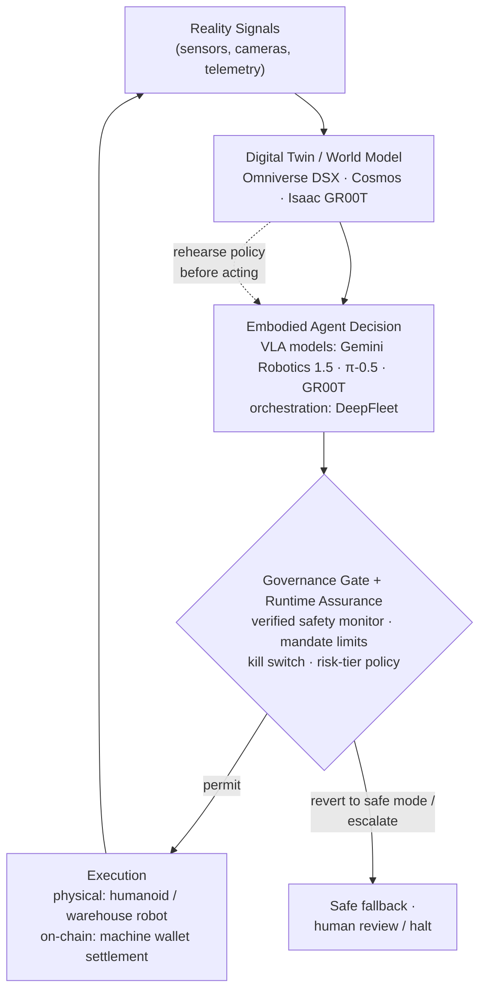

# Reality-Anchored Execution: Digital Twins, Embodied Agents, and DePIN

*The leg of the reference loop where software decisions become physical and on-chain actions — and where the gap between what is proven and what is promotional is widest.*

*Last updated: July 2026 · Part of the [Open-SDE](../README.md) research initiative.*

---

## Why this leg matters

Most of the Software-Defined Economy can be built and demonstrated in pure
software. Reality-anchored execution cannot. It is the part of the
[SDE reference loop](./concepts.md#glossary) — Reality Signals → Digital Twin →
Agent Decision → [Governance Gate](./concepts.md#glossary) → Execution — where a
decision has to move atoms, energy, or on-chain value, and where mistakes are
costly, slow to reverse, or irreversible.

This document covers the second core research area: the
**Reality Signals → Digital Twin** and **Decision → Execution** legs. Three
layers are maturing in parallel:

1. **Digital twins and world models** — the validation substrate where a policy
   is rehearsed against physics before it acts.
2. **Embodied agents (VLA models)** — the physical Decision→Execution actuator.
3. **DePIN and the machine economy** — protocol-governed markets where
   physical resources and machine-to-machine settlement clear on-chain.

The disciplined reading is that mid-2026 shows **early paid deployment**, not a
proven-at-scale physical economy. Several headline "machine economy" milestones
remain **simulation-only**, and sector-level market-cap and device-count figures
are inconsistent across promotional sources. Both caveats are flagged explicitly
below.

---

## At a glance: shipping vs. early

| Layer | Real and shipping (mid-2026) | Early or speculative |
|---|---|---|
| **Digital twins** | NVIDIA Omniverse DSX Blueprint reached general availability (March 2026) with broad industrial partner support | Open, cross-vendor twin-data interchange standards; interoperability across proprietary twin formats |
| **Embodied agents** | VLA foundation models (Gemini Robotics 1.5, π-0.5, Isaac GR00T) with cross-embodiment transfer; paid commercial humanoid deployment at BMW (Figure) | Certified governance gates for autonomous physical action; robust sim-to-real transfer for open environments |
| **Warehouse / logistics** | Amazon's 1M+ robot fleet with an AI foundation-model orchestrator (DeepFleet) | Fleet/unit counts beyond verified figures; general-purpose autonomy outside structured facilities |
| **DePIN** | "Mining-to-serving" revenue pivot with real external revenue (Render, Hivemapper, Aethir) | Durability beyond token subsidies; consistent sector market-cap and device figures |
| **Machine economy** | On-chain machine-identity registries deployed to mainnet (ERC-8004 reference registries, Jan 2026) | A *settled* identity standard — ERC-8004 itself remains a Draft ERC; robots settling real payments on live streets (current demos are simulation-only) |

---

## 1. Digital twins as the validation substrate

**A note on terms.** The general Open-SDE term for the state an agent reasons over
is the **Authoritative State Model** — the provenance-carrying, timestamped,
uncertainty-aware representation of the world that feeds a decision. A
[**digital twin**](./concepts.md#glossary) is the *physical-domain specialization*
of that model: a physically accurate replica used where decisions move atoms and
energy. In digital-commerce or API domains the authoritative state is an order
book, an inventory ledger, or an account balance rather than a twin. This document
treats digital twins because it covers the physical leg, but the loop below is the
same regardless of which authoritative-state form the domain uses.

In the SDE loop the digital twin is where a decision is
tested before it is executed: operational policies and physical constraints are
encoded in software, and an agent can rehearse scenarios against a physically
accurate replica before anything reaches reality.

The clearest production signal is industrial. In March 2026 NVIDIA
[announced general availability of the Omniverse DSX Blueprint](https://nvidianews.nvidia.com/news/nvidia-releases-vera-rubin-dsx-ai-factory-reference-design-and-omniverse-dsx-digital-twin-blueprint-with-broad-industry-support)
alongside the Vera Rubin DSX AI-factory reference design. DSX builds physically
accurate digital twins of AI data-center "factories" to simulate layout, power,
cooling, networking, and operations in real time and optimize them before
construction, with contributing partners including Siemens, Schneider Electric,
Dassault Systèmes, Cadence, PTC, Eaton, and Vertiv. (Specific DSX submodule
product names circulating in secondary coverage could not be verified against the
primary release and are omitted here.)

Alongside the twin sits the **world model** — a generative model that predicts
future physical states so that agent policies can be trained and validated in
simulation. At GTC 2026 NVIDIA
[presented an expanded physical-AI stack](https://blogs.nvidia.com/blog/gtc-2026-virtual-worlds-physical-ai/):
the Cosmos world-model family, the Isaac GR00T humanoid foundation model, and the
Mega Omniverse Blueprint for training and testing multi-robot fleets inside
physically accurate facility twins before deployment. Physical Intelligence's
π-0.5 VLA represents the parallel model-lab track.

The same closed-loop premise is now being taken up in international
standardization. On 19 February 2026 ITU-T Study Group 21 established the
[Focus Group on Embodied AI for Multimedia Technologies (FG-EAI)](https://www.itu.int/en/ITU-T/focusgroups/eai/Pages/default.aspx),
whose foundational technologies of study explicitly include real and virtual
datasets, **closed-loop control**, and **world-model training**, with dedicated
working groups on systems integration/interfaces and on **evaluation and
benchmarking**. A Focus Group is a pre-standardization, exploratory body rather than
a binding Recommendation — it signals institutional attention to embodied-AI
benchmarking and control interfaces, not a settled standard. Its agenda maps onto
the axes this leg cares about: how a policy is validated against a world model, and
how its behaviour is measured once it acts.

**Where this sits in the loop.** Digital twins and world models are the
*Reality Signals → Authoritative State Model* node made concrete for the physical
domain: a rehearsal environment where a policy is checked against physics and safety
constraints *before* the governance gate lets it touch reality. The open problem,
discussed below, is how faithful a twin must be for its decisions to be safely
executed — the sim-to-real gap.

**A caution on what the twin is not.** A digital twin is a model, not the world.
Two non-claims bound its use in the SDE: **a digital twin is not ground truth**
(it is a provenance- and uncertainty-bearing estimate that can drift from the
physical system it mirrors), and **passing a simulation is not a real-world safety
certification** (a policy that clears a twin has cleared a rehearsal, not an
accredited functional-safety process). These are stated in full among the Open-SDE
[non-claims](./authority-and-safety-model.md); they are why the sim-to-real gap and
the certified-gate problem below are treated as first-class, not incidental.

---

## 2. Embodied agents: one policy across many bodies

The physical Decision→Execution leg is being supplied by
[Vision-Language-Action (VLA) models](./concepts.md#glossary): robot foundation
models that map camera images plus a natural-language instruction directly to
motor commands.

Google DeepMind's
[Gemini Robotics 1.5](https://deepmind.google/blog/gemini-robotics-15-brings-ai-agents-into-the-physical-world/)
(announced September 2025) pairs an embodied-reasoning "brain" (Gemini
Robotics-ER 1.5, which natively calls digital tools and builds multi-step plans)
with a VLA action model that "thinks before acting" and demonstrates
**cross-embodiment transfer** — skills learned on one robot body (ALOHA 2,
Apptronik Apollo, Franka arms) transferring to others. Cross-embodiment transfer
is the property that makes software-defined control of *heterogeneous* physical
fleets plausible: one policy governing many machine bodies rather than bespoke
engineering per robot. NVIDIA's Isaac GR00T and Physical Intelligence's π-0.5
pursue the same generalization goal.

### From demo to paid deployment

The most consequential shift is that embodied agents have entered a paying
commercial deployment. Figure moved from research demo to a paid contract at
BMW's Spartanburg plant:
[Figure reports](https://www.figure.ai/news/production-at-bmw)
that its F.02 units accumulated roughly 1,250 operating hours (moving 90,000+
components) over a multi-month pilot contributing to production of 30,000+
vehicles, followed by a commercial contract for an initial fleet of the newer
Figure 03. Reported pricing on the order of ~$25 per robot-operating-hour appears
in coverage but should be treated as approximate. Other developers (Tesla Optimus,
1X, Apptronik, Agility, Boston Dynamics) have units in pilots, but **unit and
fleet counts beyond the verified BMW/Figure figures vary widely across sources
and should be treated cautiously.**

At fleet scale in structured environments, Amazon
[surpassed one million deployed robots](https://www.aboutamazon.com/news/operations/amazon-million-robots-ai-foundation-model)
across 300+ facilities (July 2025) and launched **DeepFleet**, a generative-AI
foundation model that coordinates robot movement fleet-wide, reported to improve
robot travel times by ~10%. This is logistics as a software-orchestrated
cyber-physical system: an AI orchestration layer makes agent decisions that
execute directly through robotic fleets.

**Where this sits in the loop.** Embodied agents are the Execution actuators of the
SDE in the physical world, extending software control from bits to atoms. A paid,
per-hour deployment signals that AI-directed physical labor is becoming a
schedulable, software-managed resource — but the governance gate for autonomous
physical action (see below) remains immature.

The mature engineering answer for bounding an untrusted or non-deterministic
actuator is not novel to the SDE: it is **run-time assurance (RTA)**. The pattern
originates in Lui Sha's Simplex Architecture — a verified safety monitor bounds a
complex, high-performance controller and reverts to a verified-safe baseline when a
violation is imminent — and is codified for aviation in
[ASTM F3269-21](https://store.astm.org/f3269-21.html), "Standard Practice for
Methods to Safely Bound Behavior of Aircraft Systems Containing Complex Functions
Using Run-Time Assurance," explicitly to permit AI/ML and other non-pedigreed
complex functions while maintaining safety (DARPA's Assured Autonomy program, from
2018, developed the same runtime-monitoring idea for learning-enabled systems). For
the SDE this is the template for the physical execution gate: a probabilistic VLA
policy is the untrusted complex function; a deterministic monitor bounds it and
**reverts to a safe mode** — stop, hold, hand back to a human — when a mandate or
safety limit is about to be breached. The separation of probabilistic reasoning
from deterministic enforcement is the same one the IMF draws for payments
([Note 2026/004](https://www.imf.org/en/publications/imf-notes/issues/2026/04/22/how-agentic-ai-will-reshape-payments-575560),
April 2026), applied here to motors instead of money.

---

## 3. DePIN and the machine economy

[DePIN](./concepts.md#glossary) — decentralized physical infrastructure networks —
encode the provisioning of real-world hardware (compute, mapping, wireless,
sensors, storage) as protocol rules with token-mediated incentives and on-chain
settlement: a software-defined market for physical infrastructure.

The notable 2026 development is a **"mining-to-serving" revenue pivot**: leading
networks began reporting external-customer revenue rather than purely speculative
token demand.
[Reporting](https://blockeden.xyz/blog/2026/03/12/depin-compute-revenue-pivot-akash-ionet-aethir/)
cites Render at roughly $38M monthly revenue (early 2026), Hivemapper's annualized
revenue rising ~36× (from ~$0.5M in August 2025 to ~$18M by early 2026) selling
street-level map data, and Aethir at ~$166M ARR serving enterprise AI compute.
Genuine external revenue suggests these protocol-governed markets can clear
against real demand.

Two caveats are load-bearing. First, these figures come from **secondary and
partly promotional sources**, and sector-wide market-cap and device-count totals
(quoted anywhere from ~$40B to $900B+) are **inconsistent across sources** and
should be treated as uncertain. Second, whether DePIN economics are durable
*beyond token subsidies* — what fraction of demand is genuine paying customers
versus incentive farming — is unresolved.

### Machines as economic agents — but mostly in simulation

DePIN is beginning to fuse with robotics into a "machine economy," where a machine
— acting under authority delegated by its operator, not as an independent legal
person — holds an on-chain identity and wallet and transacts machine-to-machine. On
May 12, 2026, peaq
[demonstrated](https://cryptonews.net/news/altcoins/32906537/)
a Serve Robotics delivery bot navigating a *simulated* urban environment,
completing a delivery, and settling payment autonomously in USDT (using Tether's
Wallet Development Kit with Solana as the settlement layer); a companion demo used
LG's CLOi ServeBot in LG's simulator.

This is a clean illustration of the SDE loop with a machine exercising delegated
authority — a robot holding a wallet, making a navigation decision, and settling
on-chain — but
it is critical to state plainly: **these were simulation and demonstration
environments, not live street deployment.** As of this writing, the on-chain
settlement leg of the physical machine economy is demonstrated, not deployed.

### The identity and settlement substrate

For machines to be counterparties, they need durable, verifiable identities. That
substrate is emerging, but is not yet settled:
[ERC-8004 "Trustless Agents"](https://eips.ethereum.org/EIPS/eip-8004)
defines three on-chain registries (Identity, Reputation, Validation) that give
agents verifiable identities and reputation signals for cross-organizational
discovery without prior trust, and its reference registries went live on Ethereum
mainnet on January 29, 2026. The specification itself, however, remains a **Draft**
Standards-Track ERC (created August 2025, still Draft as of mid-2026) — deployed
reference code is not a finalized standard, so mandate enforcement should not treat
its registry semantics as stable.

On the settlement side, a hard measurement exists but is small relative to the
hype:
[a Keyrock analysis reported by CoinDesk](https://www.coindesk.com/business/2026/05/21/crypto-rails-are-becoming-the-default-payment-layer-for-ai-agents-report-says)
found agents settled roughly 176M on-chain transactions worth over $73M between
May 2025 and April 2026, 98.6% in USDC. And organic demand for autonomous agent
payments is still thin: on-chain analysis
[found the x402 protocol processing only ~$28,000 per day](https://www.coindesk.com/markets/2026/03/11/coinbase-backed-ai-payments-protocol-wants-to-fix-micropayment-but-demand-is-just-not-there-yet)
in early 2026, with roughly half of transactions estimated to be artificial. The
machine-economy rails exist; realized machine-to-machine activity through them is
nascent. (These payment rails are covered in depth in
[agent-native-economy.md](./agent-native-economy.md).)

---

## The reality-anchored execution loop

The dotted edge is the point of this leg: the twin is where a policy is validated
against physics *before* the gate permits execution. In today's deployments the
gate for physical action is still largely operator-defined and uncertified — the
central open problem below.

---

## Open problems

These are the unresolved questions that a serious SDE research program must treat
as first-class. They feed directly into [ROADMAP.md](../ROADMAP.md).

- **The sim-to-real gap.** How faithful must a digital twin be for a policy proven
  only in simulation to be executed safely in reality? Several 2026 robot
  "on-chain payment" and physical-autonomy demos remain simulation-only, which
  makes validation standards a prerequisite, not a nicety.
- **A certified governance gate for physical action.** As humanoids and delivery
  robots act on the world, *where* are safety and policy constraints enforced in
  software, *who* certifies them, and *how* are they audited after an incident?
  The safety-engineering template exists — run-time assurance per
  [ASTM F3269-21](https://store.astm.org/f3269-21.html), a verified monitor that
  bounds a complex function and reverts to a safe mode — but wiring an
  aviation-grade RTA discipline to a probabilistic VLA policy, and certifying that
  wiring, is far less mature than the runtime policy engines emerging for software
  agents (see [governance-as-code.md](./governance-as-code.md)).
- **Liability and machine legal personhood.** When a machine holds its own wallet
  and transacts autonomously, can a code-defined agent be a counterparty, and who
  is accountable for a bad autonomous decision?
- **Twin interoperability.** Can proprietary industrial twin/simulation stacks
  interoperate, or does the SDE physical layer risk consolidating around a single
  vendor's twin format? Open standards for twin-data exchange and twin-to-execution
  APIs are largely absent.
- **End-to-end integration.** Do digital twins, DePIN settlement, embodied agents,
  and logistics automation compose into a single closed loop yet — or are they
  still largely **siloed pilots** that a real SDE would need to stitch together?

A note on excluded claims: an "autonomous AI grid operator" narrative (AI acting as
an autonomous power-grid operator, self-healing grids, LLM agents interpreting
market rules on live infrastructure in 2026) appeared in the source material but
was sourced only to a promotional content-farm article with no primary
corroboration, and is **excluded** as unverifiable. Virtual power plants exist as
a concept; the "autonomous AI grid operator acting on reality" framing does not
hold up and should not be reintroduced.

---

## Related

- [concepts.md](./concepts.md) — SDE definitions, primitives, and the full glossary
  of terms used above (digital twin, VLA model, DePIN, governance gate).
- [agent-native-economy.md](./agent-native-economy.md) — the Agent-Decision node,
  agent identity, and the payment/settlement rails referenced here.
- [governance-as-code.md](./governance-as-code.md) — the executable governance gate,
  which for physical action remains the least mature layer.
- [authority-and-safety-model.md](./authority-and-safety-model.md) — delegated
  authority, run-time assurance, and the full list of Open-SDE non-claims referenced
  above (digital twin ≠ ground truth; passing simulation ≠ safety certification).
- [reference-architecture.md](./reference-architecture.md) — the full reference loop
  expanded, including the machine-economy worked example.
- [landscape-2026.md](./landscape-2026.md) — the dated, cross-cutting survey of what
  is shipping mid-2026.
- [ROADMAP.md](../ROADMAP.md) — the open questions above, prioritized.

See [references.md](./references.md) for the full, annotated source list.
