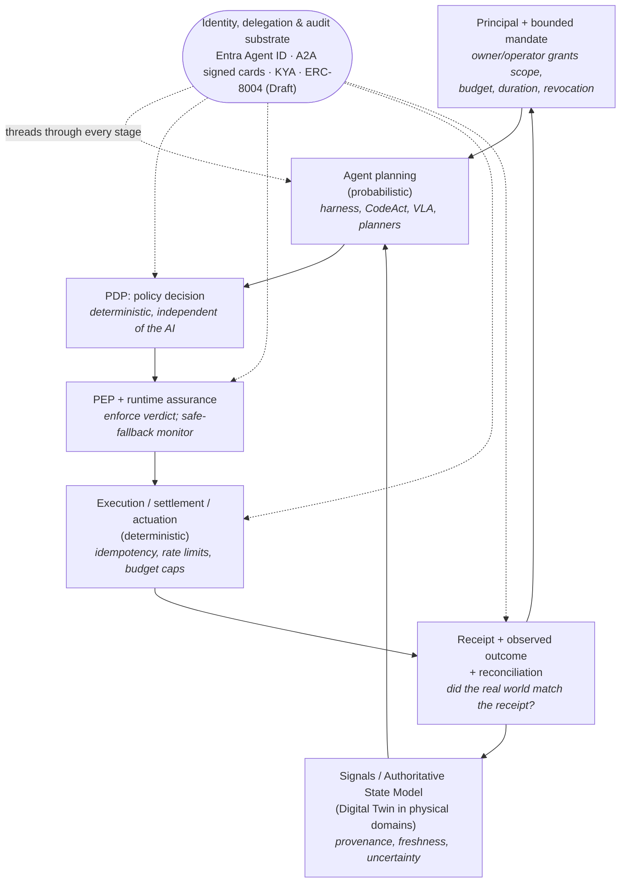

# The SDE Reference Architecture

*The Software-Defined Economy loop redrawn for **assured bounded autonomy** — who grants an agent authority, how that authority is bounded and revoked, and how probabilistic AI judgment is separated from deterministic authorization, execution, settlement, and accountability.*

*Last updated: July 2026 · Part of the [Open-SDE](../README.md) research initiative.*

---

## Purpose

The [README](../README.md) states a five-stage [SDE reference loop](./concepts.md#glossary) —
**Reality Signals → Digital Twin → Agent Decision → Governance Gate → Execution** — as the
minimum unit of a [Software-Defined Economy](./working-definition-and-scope.md). That loop is
a useful conceptual sketch, but it hides the two distinctions that actually make an SDE safe
to build. This document turns the sketch into a *reference architecture* organized around
those distinctions.

The [working definition](./working-definition-and-scope.md) is the anchor:

> A Software-Defined Economy is a socio-technical system in which software agents, operating
> under delegated authority, allocate scarce resources or initiate state-changing actions
> through explicit policy, authorization, execution, settlement, and accountability controls.

Two commitments follow from that definition, and the rest of this document is their
elaboration:

1. **Separate the probabilistic from the deterministic.** Reasoning, intent formation, and
   orchestration may be probabilistic; authorization, control, settlement, and accountability
   must be deterministic and auditable. This is not an Open-SDE invention — it is the central
   argument of the IMF's April 2026 note *How Agentic AI Will Reshape Payments*, which
   proposes a three-layer framework keeping intent/orchestration probabilistic while the
   authorization/control and settlement layers stay strictly deterministic
   ([IMF Note 2026/004, April 2026](https://www.imf.org/en/publications/imf-notes/issues/2026/04/22/how-agentic-ai-will-reshape-payments-575560)).
2. **Split the governance gate into a decider and an enforcer.** The single "Governance Gate"
   node is really two roles: a **Policy Decision Point (PDP)** that evaluates whether an
   action is permitted, and a **Policy Enforcement Point (PEP)** that intercepts the action
   and enforces the verdict. That split predates agents — it comes from the ABAC/XACML access-
   control tradition — and in January 2026 it was standardized as a wire protocol by the
   OpenID **AuthZEN Authorization API 1.0**, a Final OpenID specification defining the JSON API
   a PEP uses to ask a PDP for a decision
   ([OpenID AuthZEN, Jan 2026](https://openid.net/specs/authorization-api-1_0.html)).

The discipline the rest of the repository insists on applies here: a reference architecture is
only honest if it separates what is **proven and shipping** from what remains **draft, early,
or simulation-only**. As of mid-2026 each stage of this architecture has production-grade
building blocks, but a *fully integrated, end-to-end autonomous traversal* is still rare —
most working systems keep a human setting authority and handling exceptions, and the most
complete machine-to-machine traversals run in simulation. This is a research frame, not a
standard or an operationally-ready system.

---

## The assured-bounded-autonomy loop



ASCII fallback:

```
   ┌──────────────────────────────────────────────────────────────┐
   │                                                              │
   ▼                                                              │
Principal + bounded mandate ──────────────┐                       │
   │                                       │ (authority, budget,   │
   ▼                                       │  revocation)          │
Agent planning (PROBABILISTIC) ◀── Signals / Authoritative State Model
   │                                       ▲   (Digital Twin in physical domains)
   ▼                                       │                       │
PDP: policy decision (DETERMINISTIC)       │                       │
   │                                       │                       │
   ▼                                       │                       │
PEP + runtime assurance (DETERMINISTIC)    │                       │
   │                                       │                       │
   ▼                                       │                       │
Execution / settlement / actuation (DETERMINISTIC)                 │
   │                                       │                       │
   ▼                                       │                       │
Receipt + observed outcome + reconciliation ──────────────────────┘
   │        (did the real world match the receipt?)
   └────────────────────► back to Principal (accountability, revocation)

  Identity, delegation & audit substrate (Entra Agent ID · A2A signed
  Agent Cards · KYA · ERC-8004 [Draft]) threads through every stage.
```

The dashed line down the middle of this loop is the probabilistic/deterministic boundary. To
the *left/top* — the principal's mandate, the agent's planning, the state it reasons over —
uncertainty is expected and acceptable. From the **PDP onward**, everything is deterministic:
a policy decision either permits or denies, an enforcement point either allows or blocks, a
settlement either clears or does not, and a receipt is either reconciled against reality or
flagged. An agent whose reasoning is redirected by an [Agent Goal Hijack](./concepts.md#glossary)
attack can still only *request*; it cannot enlarge its own authority, because the deciding and
enforcing components sit outside the model.

The rest of this document takes each stage in turn. A `[shipping]`, `[early / draft]`, or
`[simulation]` tag marks the maturity of each instantiating technology, respecting the
fact-checked verdicts recorded in [references.md](./references.md).

---

### Stage 0 — Principal and bounded mandate

The loop does not begin with data; it begins with **delegation**. Every action an agent takes
must be traceable to a principal (the human or organization on whose behalf it acts), an
owner/operator (accountable for running it), and a **mandate** that states the agent's scope,
budget, duration, target, and revocation conditions. Agents in this architecture are *software
agents acting under delegated authority*, never "first-class economic actors." The human role
does not disappear — it moves from per-action approval to **setting authority, budgets,
monitoring, revocation, and exception handling**. AI recommends; humans decide the bounds.

The 2026 primitives that record a bounded mandate are already concrete:

- **Deployment-level authorization profiles `[shipping]`/`[early]`.** The WEF/Capgemini
  Agent Capability and Authorization Profile (ACAP, 26 May 2026) records an agent's delegated
  power — permitted actions, contexts, conditions, and oversight — in one auditable record
  ([WEF, May 2026](https://www.weforum.org/publications/ai-agents-in-action-a-playbook-for-trusted-adoption-authorization-and-scaling/)).
- **Cryptographic, scope-bounded authority `[shipping]`.** In payments the mandate becomes a
  signed instrument: AP2 [Mandates](./concepts.md#glossary) (W3C Verifiable Credentials
  encoding intent, scope, and spend limits) and ACP [Shared Payment Tokens](./concepts.md#glossary)
  scoped to a single merchant and cart total.

The [action-mandate schema](../schemas/action-mandate.schema.json) is Open-SDE's attempt to
make this stage machine-checkable. See [authority-and-safety-model.md](./authority-and-safety-model.md)
for how a mandate is granted, bounded, and revoked.

---

### Stage 1 — Agent planning (probabilistic)

This is the one stage where probabilistic judgment is the point. It is where 2026 saw the
sharpest transition from research demo to product, driven by the **agent harness**: a runtime
layer wrapping the model that handles context compaction, memory, tool/file access, sandboxed
execution, and middleware, so an agent can own a long task without exhausting its context
window.

- **Production SDK harnesses `[shipping]`.** Microsoft shipped Agent Framework 1.0 to GA in
  early April 2026, unifying AutoGen and Semantic Kernel with native MCP/A2A support and
  tool-approval middleware
  ([Microsoft Learn, April 2026](https://learn.microsoft.com/en-us/agent-framework/overview/)).
  At Build 2026 Microsoft introduced the harness layer explicitly, session-isolated Foundry
  Hosted Agents, and **CodeAct** — collapsing a multi-step plan into a single sandboxed
  program run in an isolated micro-VM
  ([Microsoft, Build 2026](https://devblogs.microsoft.com/agent-framework/microsoft-agent-framework-at-build-2026-announce/)).
  OpenAI shipped a model-native sandboxed harness for long-horizon coding agents on
  15 April 2026 ([OpenAI, April 2026](https://openai.com/index/the-next-evolution-of-the-agents-sdk/)),
  and Anthropic's Claude Agent SDK underpins hosted Managed Agents with scheduling, a
  memory-curating "dreaming" pass, and outcomes-based grading (6 May 2026)
  ([Anthropic, May 2026](https://claude.com/blog/new-in-claude-managed-agents)).
- **Embodied planning `[shipping]`/`[early]`.** For physical execution the planning layer is a
  [Vision-Language-Action model](./concepts.md#glossary). Google DeepMind's Gemini
  Robotics 1.5 pairs an embodied-reasoning "brain" (tool-calling, multi-step planning) with a
  VLA action model showing cross-embodiment transfer across robot bodies
  ([Google DeepMind, Sept 2025](https://deepmind.google/blog/gemini-robotics-15-brings-ai-agents-into-the-physical-world/)).
- **Control primitives `[shipping]`.** Open-source frameworks specialized: LangGraph for
  controlled production (state persistence, human-in-the-loop checkpoints, rollback) versus
  CrewAI for role-based prototyping
  ([framework comparison, April 2026](https://pecollective.com/blog/ai-agent-frameworks-compared/)).
  These checkpoints and rollback points are the hooks the PDP and PEP attach to.

How much of a workflow this stage can plan is proxied by the [METR time horizon](./concepts.md#glossary):
METR's benchmark (updated 8 May 2026) places frontier 50%-reliability horizons in the
multi-hour range, with the historical ~7-month doubling widely *reported* as compressing —
though METR flags measurements above 16 hours as unreliable and its page states no precise
doubling figure ([METR, May 2026](https://metr.org/time-horizons/)). Treat the trend as
directional. Crucially, rising planning capability does **not** relax the deterministic stages
downstream — a more capable planner still only produces *requests* that the PDP must
independently authorize.

---

### Stage 2 — Signals and the Authoritative State Model

An agent reasons not over raw reality but over a model of it. The **Authoritative State
Model** is the general term for that state: the union of sensor feeds, catalogs, market and
on-chain data, and principal intent, carrying — this is the load-bearing requirement —
**provenance, timestamp, freshness, and uncertainty** for each input. The **Digital Twin** is
the *physical-domain specialization* of this idea: a physically accurate replica used to
rehearse a policy against physics, cost, and safety before it touches reality. Digital-commerce
and pure-API domains have an Authoritative State Model without a Digital Twin, and forcing
"Digital Twin" onto them is a category error.

- **Machine-legible commerce state `[shipping]`.** Google's Universal Commerce Protocol
  exposes retail catalogs and checkout to agents as a structured, queryable surface rather than
  a human-only web UI — a state layer describing what can be bought. Google launched Universal
  Cart on this substrate in May 2026
  ([Google, May 2026](https://blog.google/products-and-platforms/products/shopping/google-shopping-cart/)).
  McKinsey frames this "agent-ready," machine-readable-catalog prerequisite as the gating
  condition for agent-mediated commerce to scale at all
  ([McKinsey, Oct 2025](https://www.mckinsey.com/capabilities/quantumblack/our-insights/the-automation-curve-in-agentic-commerce)).
- **Industrial Digital Twins `[shipping]`.** NVIDIA made its Omniverse DSX Blueprint generally
  available on 16 March 2026 alongside the Vera Rubin DSX reference design, building physically
  accurate twins of AI-data-center "factories" to simulate power, cooling, networking, and
  operations before construction
  ([NVIDIA, March 2026](https://nvidianews.nvidia.com/news/nvidia-releases-vera-rubin-dsx-ai-factory-reference-design-and-omniverse-dsx-digital-twin-blueprint-with-broad-industry-support)).
- **World models as rehearsal environments `[shipping]`.** At GTC 2026 NVIDIA presented a
  physical-AI stack — Cosmos world models, Isaac GR00T, and the Mega Omniverse Blueprint for
  training and testing multi-robot fleets inside facility twins before deployment
  ([NVIDIA, March 2026](https://blogs.nvidia.com/blog/gtc-2026-virtual-worlds-physical-ai/)).

The open problem is the **sim-to-real gap**: a Digital Twin is *not* ground truth, and a
policy that passes in simulation is *not* certified safe in reality (two of the [eight
non-claims](./authority-and-safety-model.md)). Several 2026 "machine economy" milestones — the
peaq/Serve Robotics demo discussed below — remain simulation-only precisely because certified
governance for autonomous physical action does not yet exist `[simulation]`. Open-SDE's
[reality-signal](../schemas/reality-signal.schema.json) and
[twin-state](../schemas/twin-state.schema.json) schemas are where provenance and uncertainty
are meant to be carried explicitly.

---

### Stage 3 — PDP: the policy decision point

Here the deterministic half of the loop begins. The **Policy Decision Point** takes the
agent's proposed action plus the mandate, identity, and state context, and returns a permit or
deny verdict — and it must be **independent of the AI**, so that an attacker who has hijacked
the agent's reasoning cannot also change the decision. This is why enforcement lives *at the
gate*, not in the agent's own reasoning: OWASP's first Top 10 for Agentic Applications
(9 December 2025) ranks [Agent Goal Hijack (ASI01)](./concepts.md#glossary) as the top risk
([OWASP, Dec 2025](https://genai.owasp.org/2025/12/09/owasp-top-10-for-agentic-applications-the-benchmark-for-agentic-security-in-the-age-of-autonomous-ai/)).

- **A standardized decision API `[shipping / Final]`.** The OpenID AuthZEN Authorization
  API 1.0, approved as an OpenID Final Specification in January 2026, defines the transport-
  agnostic JSON API a PEP uses to ask a PDP for an access-evaluation decision — externalizing
  authorization so the deciding component is a separate, interoperable service rather than
  logic buried in the agent
  ([OpenID AuthZEN, Jan 2026](https://openid.net/specs/authorization-api-1_0.html)). PDP/PEP
  terminology originates in the ABAC/XACML tradition; AuthZEN standardizes the wire format
  between the two.
- **Policy-as-code at the tool boundary `[early]`.** The complementary pattern enforces
  [Open Policy Agent](./concepts.md#glossary) at the tool-calling / MCP-gateway layer, so the
  policy engine — not the agent — decides what is permitted
  ([OPA-at-the-gateway pattern, 2026](https://codilime.com/blog/why-use-open-policy-agent-for-your-ai-agents/)).
- **Where policy comes from `[shipping]`.** The PDP consumes both organizational rules and
  regulation. EU AI Act GPAI obligations have applied since 2 August 2025, with Commission
  enforcement powers exercisable from 2 August 2026
  ([EU AI Act, Chapter V](https://artificialintelligenceact.eu/enforcement-of-chapter-v-under-the-eu-ai-act/)),
  even as the Digital Omnibus deferred most high-risk obligations to late 2027/2028 — a signal
  that the machine-checkable technical standards a PDP would consume are not yet ready
  ([Council of the EU, June 2026](https://www.consilium.europa.eu/en/press/press-releases/2026/06/29/artificial-intelligence-council-gives-final-green-light-to-simplify-and-streamline-rules/)).
  Policy-to-code traceability is the goal here — executable rules that map back to a written
  policy — **not** governance-as-code replacing law. Code complements organizational and legal
  responsibility; it never substitutes for it.

Open-SDE's [policy-decision schema](../schemas/policy-decision.schema.json) models the PDP's
input and verdict.

---

### Stage 4 — PEP and runtime assurance

The **Policy Enforcement Point** is the component the agent's action actually flows through; it
intercepts the request and enforces the PDP's verdict — allow, block, or escalate. Wrapped
around it is a **runtime assurance** monitor, and this is an *established* safety-engineering
concept, not a novelty.

- **Runtime assurance as inherited practice `[established]`.** The pattern originates in Lui
  Sha's Simplex Architecture — a verified safety monitor bounds an untrusted, high-performance
  controller and reverts to a verified-safe baseline when a violation is imminent. ASTM
  International codified it as **F3269-21**, *Standard Practice for Methods to Safely Bound
  Behavior of Aircraft Systems Containing Complex Functions Using Run-Time Assurance*,
  explicitly to permit AI/ML and other non-pedigreed complex functions in aircraft while
  preserving safety ([ASTM F3269-21](https://store.astm.org/f3269-21.html)); DARPA's Assured
  Autonomy program developed run-time monitoring for learning-enabled cyber-physical systems.
  In SDE terms: the trusted PEP + monitor bounds the untrusted agent, and "reversion to a safe
  mode" is the safe fallback every enforcement point must have.
- **Runtime policy engines `[shipping]`.** Microsoft open-sourced the MIT-licensed Agent
  Governance Toolkit on 2 April 2026, whose Agent OS intercepts every agent action before
  execution at sub-millisecond latency, with CPU-style execution rings and a kill switch, and
  maps controls to EU AI Act/HIPAA/SOC2
  ([Microsoft, April 2026](https://opensource.microsoft.com/blog/2026/04/02/introducing-the-agent-governance-toolkit-open-source-runtime-security-for-ai-agents/)).
  This is a PEP with an integrated runtime-assurance kill switch.
- **Human-in-the-loop escalation in the protocol `[early]`.** When the PEP escalates rather
  than blocks, the MCP 2026-07-28 release candidate standardizes the round trip: a server
  returns an `InputRequiredResult` and the client gathers user input before re-issuing the
  call (SEP-2322), alongside OAuth 2.1/OIDC hardening
  ([MCP RC, July 2026](https://blog.modelcontextprotocol.io/posts/2026-07-28-release-candidate/)).

This is where "humans decide" is made operational: the PEP is the point at which an escalation
becomes a human exception rather than an autonomous commitment.

---

### Stage 5 — Execution, settlement, and actuation

Execution is where an *enforced* decision touches reality: an API call, an on-chain
settlement, or a physical action. It must be deterministic and defensive — **idempotency, rate
limits, budget caps, and a safe fallback** — so a retry or a partial failure cannot silently
double-spend or over-actuate. This is the most visibly built-out stage, though built
*infrastructure* is not the same as *clearing demand* (see the reality check below).

- **Agentic payment rails `[shipping]`.** The OpenAI + Stripe Agentic Commerce Protocol powers
  ChatGPT Instant Checkout via Shared Payment Tokens
  ([Stripe, Sept 2025](https://stripe.com/newsroom/news/stripe-openai-instant-checkout));
  Google's AP2 was donated to the FIDO Alliance and shipped v0.2 with "Human Not Present"
  payments ([Google, April 2026](https://blog.google/products-and-platforms/platforms/google-pay/agent-payments-protocol-fido-alliance/));
  Coinbase/Cloudflare's [x402](./concepts.md#glossary) was formalized under the Linux
  Foundation on 2 April 2026
  ([Linux Foundation, April 2026](https://www.linuxfoundation.org/press/linux-foundation-is-launching-the-x402-foundation-and-welcoming-the-contribution-of-the-x402-protocol));
  and Stripe/Tempo's [Machine Payments Protocol](./concepts.md#glossary) adds a "sessions"
  spend-cap primitive ([Stripe, March 2026](https://stripe.com/blog/machine-payments-protocol)).
  Card networks anchor the credential layer
  ([Mastercard Agent Pay for Machines, June 2026](https://www.mastercard.com/us/en/news-and-trends/press/2026/june/mastercard-launches-agent-pay-for-machines.html)),
  and hyperscalers embedded these rails directly
  ([AWS Bedrock AgentCore Payments, May 2026](https://aws.amazon.com/blogs/machine-learning/agents-that-transact-introducing-amazon-bedrock-agentcore-payments-built-with-coinbase-and-stripe/)).
  The recurring pattern across all of them is **scoped, cryptographic authority** — the mandate
  from Stage 0 enforced at the point of irreversible action.
- **Physical actuation `[early]`.** Figure moved from demo to a paid commercial deployment at
  BMW Spartanburg ([Figure AI](https://www.figure.ai/news/production-at-bmw)), and Amazon's
  DeepFleet orchestrates a 1M+ robot fleet
  ([Amazon, July 2025](https://www.aboutamazon.com/news/operations/amazon-million-robots-ai-foundation-model)) —
  though most deployments keep humans in the safety loop.
- **On-chain settlement `[shipping]`.** A Keyrock/CoinDesk analysis found agents settled
  ~176M on-chain transactions worth >$73M between May 2025 and April 2026, 98.6% in USDC
  ([CoinDesk, May 2026](https://www.coindesk.com/business/2026/05/21/crypto-rails-are-becoming-the-default-payment-layer-for-ai-agents-report-says)).

Open-SDE's [execution-receipt schema](../schemas/execution-receipt.schema.json) records what
the execution layer claims to have done — which is the input to the next stage, not the end of
the loop.

---

### Stage 6 — Receipt, observed outcome, and reconciliation

The most-skipped stage, and the one that separates this architecture from a naïve pipeline:
**a transaction receipt is not proof of a real-world outcome.** A payment can settle while the
goods never ship; a robot can report task-complete while the shelf is still empty; an on-chain
transaction can be immutable while its external input was wrong. Reconciliation is the explicit
comparison of the **execution receipt** against the **observed real-world outcome**, feeding
any discrepancy back to the Authoritative State Model (to correct the agent's picture of the
world) and to the principal (for accountability, and if needed, revocation).

This is continuous monitoring, not a one-time check, and it has authoritative backing. NIST's
final report **AI 800-4**, *Challenges to the Monitoring of Deployed AI Systems* (CAISI,
6 March 2026), argues that pre-deployment evaluation is insufficient on its own and proposes
**six** post-deployment monitoring categories — Functionality, Operational, Human Factors,
Security, Compliance, and Large-Scale Impacts — drawn from three workshops with 200+ experts
and an 87-paper literature review
([NIST AI 800-4, March 2026](https://nvlpubs.nist.gov/nistpubs/ai/NIST.AI.800-4.pdf)).
Reconciliation is where those categories are checked against what actually happened.

Two of the [eight non-claims](./authority-and-safety-model.md) are enforced precisely at this
stage: *transaction success ≠ real action success*, and *blockchain immutability ≠ truth of
external inputs or physical outcomes*. Incident logging, recovery, and human override belong
here too — see [assurance/incident-and-recovery.md](../assurance/incident-and-recovery.md).

---

## The identity, delegation, and audit substrate

Every deterministic stage presupposes that the actors can be *identified*. [Agent
identity](./concepts.md#glossary) — durable, credentialed, revocable machine identity — is
therefore not a stage but a **substrate threaded through all of them**. You cannot evaluate a
mandate at a PDP, enforce it at a PEP, attribute a settlement, or reconcile an outcome without
it. And identity is not authorization: *authenticating an agent is not the same as authorizing
a specific action* — the PDP still has to decide.

- **Enterprise identity `[shipping]`.** Microsoft Entra Agent ID manages agents as
  first-class, credentialed, revocable identities
  ([Microsoft Learn, 2026](https://learn.microsoft.com/en-us/entra/agent-id/whats-new-agent-id)).
- **Cross-organization trust `[shipping]`.** A2A reached a stable v1.0 under the Linux
  Foundation with cryptographically signed Agent Cards
  ([Linux Foundation, April 2026](https://www.linuxfoundation.org/press/a2a-protocol-surpasses-150-organizations-lands-in-major-cloud-platforms-and-sees-enterprise-production-use-in-first-year)).
- **On-chain identity `[early / draft]`.** [ERC-8004 Trustless Agents](./concepts.md#glossary)
  defines three registries (Identity, Reputation, Validation). It remains a **Draft** Ethereum
  proposal (Standards Track, created August 2025, still Draft as of mid-2026); reference
  registries were deployed to Ethereum mainnet in early 2026, but the specification itself is
  unfinished, so its wire format and registry semantics should not be treated as stable
  ([ERC-8004](https://eips.ethereum.org/EIPS/eip-8004)).
- **Know Your Agent `[early]`.** [KYA](./concepts.md#glossary) — cryptographically signed
  credentials binding an agent to its principal, constraints, and liability — is proposed by
  a16z ([a16z, Dec 2025](https://a16z.com/newsletter/big-ideas-2026-part-1/)) and
  operationalized in Skyfire's KYAPay
  ([Skyfire, Dec 2025](https://www.businesswire.com/news/home/20251218520399/en/Skyfire-Demonstrates-Secure-Agentic-Commerce-Purchase-Using-the-KYAPay-Protocol-and-Visa-Intelligent-Commerce)).

Standards bodies are converging on exactly this substrate. NIST's AI Agent Standards Initiative
(CAISI with ITL, announced 17 February 2026) advances along three pillars, including an ITL
*AI Agent Identity and Authorization Concept Paper*
([NIST, Feb 2026](https://www.nist.gov/artificial-intelligence/ai-agent-standards-initiative)),
and ITU-T's newly established Focus Group on Trust and Identity for Humans and Agentic AI
(FG-TIDA, announced 9 July 2026, first meeting Paris November 2026) targets identity, trust-
lifecycle assurance, and "meaningful human control" for high-stakes tasks
([ITU, July 2026](https://www.itu.int/en/mediacentre/Pages/PR-2026-07-09-focus-group-agentic-AI.aspx)).
A Focus Group is a pre-standardization body, not a binding standard — useful as a signal of
institutional convergence, not as settled ground to build on.

---

## Gate strictness as a function of risk

Not every action deserves the same PDP posture. Singapore's Model AI Governance Framework for
Agentic AI (22 January 2026) organizes governance around **risk factors** — reversibility of
the action, autonomy level, data sensitivity, read-versus-write permission, external-system
exposure ([IMDA, Jan 2026](https://www.imda.gov.sg/resources/press-releases-factsheets-and-speeches/press-releases/2026/new-model-ai-governance-framework-for-agentic-ai)).
Mapped onto this architecture, those factors set how strict the PDP verdict and the PEP
enforcement must be:

| Action class | Example | Reversible? | PDP / PEP posture |
| --- | --- | --- | --- |
| Read-only | Query a catalog, read on-chain state | Yes | PDP auto-permit; PEP logs |
| Bounded write | Post within a scoped Mandate / spend cap | Partially | PDP permits within scope; PEP escalates on breach |
| Money movement | Settle a purchase, transfer funds | Rarely | Scoped token **required**; PEP step-up or human escalation above threshold |
| Access / config change | Grant permissions, alter a standing rule | No | Mandatory human decision; PEP blocks until confirmed |
| Irreversible physical act | Autonomous physical action with safety impact | No | Human-gated; simulation-validated; runtime-assurance monitor with verified safe fallback (not yet mature) |

The reversibility boundary — which actions must stay human-gated because they move money,
change access, or cannot be undone — is an **open research question**, not a settled answer.
The [Roadmap](../ROADMAP.md) tracks it as such.

---

## How this maps to SDE-0

The [SDE-0 minimum conformance profile](./sde-0-conformance-profile.md) is the checklist form
of this architecture. Each of its seven requirements corresponds to a stage or the substrate:

| SDE-0 requirement | Where it lives in this architecture |
| --- | --- |
| 1 · Identifiable principal, owner/operator, and agent | Stage 0 + identity substrate |
| 2 · A mandate stating scope, budget, duration, target, revocation | Stage 0 |
| 3 · State inputs carrying provenance, timestamp, freshness, uncertainty | Stage 2 |
| 4 · A PDP/PEP independent of the AI | Stages 3–4 |
| 5 · Execution with idempotency, rate limits, budget caps, safe fallback | Stage 5 |
| 6 · Reconciliation of the receipt against the observed outcome | Stage 6 |
| 7 · Continuous monitoring, incident logging, recovery, human override | Stage 6 + substrate |

A system that instantiates every stage but skips, say, reconciliation (requirement 6) is not
SDE-0 conformant, however impressive its agent planning.

---

## Two worked instantiations

Annotating the loop is abstract. Here are two end-to-end traversals using real 2026 systems —
one proven at consumer scale, one still confined to simulation — re-annotated to the PDP / PEP
/ reconciliation model.

### A · Agentic commerce — ChatGPT Instant Checkout `[shipping]`

A consumer-scale traversal that closes the loop inside an LLM interface.

```mermaid
sequenceDiagram
    participant U as Principal (user intent + mandate)
    participant A as Agent planning (ChatGPT, probabilistic)
    participant M as Authoritative State Model (merchant catalog)
    participant D as PDP (SPT scope policy)
    participant E as PEP (token issuance / enforcement)
    participant X as Execution (Stripe/ACP settlement)
    U->>A: "Buy this item" (bounded intent)
    A->>M: Query catalog / build cart (state)
    A->>D: Request authority scoped to merchant + cart total
    D-->>E: Permit within scope
    E-->>A: Shared Payment Token issued (authority bounded to one cart)
    A->>X: Initiate payment with SPT (no raw card credentials)
    X-->>U: Receipt; reconcile order confirmation vs. fulfilment
```

- **Principal + mandate.** The user supplies bounded intent ("buy this item").
- **Agent planning (probabilistic).** ChatGPT assembles a cart from that intent.
- **Authoritative State Model.** The merchant catalog (via a schema layer such as UCP) is the
  machine-legible state the agent reasons over — no Digital Twin needed; this is a pure-commerce
  domain.
- **PDP + PEP.** The decision to grant a [Shared Payment Token](./concepts.md#glossary) scoped
  to exactly one merchant and one cart total is the policy verdict; issuing that token and
  refusing anything outside its scope is enforcement. The agent's spend power is
  cryptographically bounded
  ([Stripe/OpenAI ACP](https://stripe.com/newsroom/news/stripe-openai-instant-checkout)).
- **Execution.** Settlement runs over ACP without exposing the buyer's card credentials.
- **Reconciliation.** The receipt returns as a signal; a complete implementation compares it
  against fulfilment (did the order actually ship?), not just against settlement success.

Why this is `[shipping]`: it runs today at consumer scale, but the human still supplies the
mandate and, in most flows, approves the payment — bounded autonomy in the middle, not
end-to-end autonomy. Reconciliation against fulfilment, rather than against the payment
receipt, is the stage most often left implicit.

### B · Machine economy — peaq / Serve Robotics on-chain delivery `[simulation]`

A machine-to-machine traversal where the actor under delegated authority is a robot with its
own wallet. It is the most *complete* traversal of all stages among machines — and it runs in
simulation, which is exactly why it belongs in the "early / simulation" column.

```mermaid
sequenceDiagram
    participant Env as Digital Twin (simulated city, NAVER Maps)
    participant Bot as Serve bot (peaqOS identity + bounded wallet)
    participant Nav as Agent planning (VLA / route planner)
    participant D as PDP (wallet + route policy)
    participant E as PEP + runtime assurance (safe-stop monitor)
    participant X as Execution (USDT settlement on Solana)
    Env->>Bot: Signals (simulated)
    Bot->>Nav: Plan delivery route (state → planning)
    Nav->>D: Request settlement within wallet policy
    D-->>E: Permit (bounded authority)
    E->>X: Enforce, then settle delivery in USDT
    X-->>Bot: Receipt; reconcile "delivered" vs. observed drop-off
```

On 12 May 2026 peaq demonstrated a Serve Robotics delivery bot navigating a *simulated* urban
environment (via NAVER Maps / a simulated Seoul), completing a delivery and settling payment
autonomously in USDT using Tether's Wallet Development Kit with Solana as the settlement layer
([Cryptonews, May 2026](https://cryptonews.net/news/altcoins/32906537/)). Re-annotated: the
simulated city is the **Digital Twin** (the physical-domain Authoritative State Model), the
robot holds a peaqOS identity and bounded wallet (Stage 0 + substrate), plans a route
(probabilistic), passes a wallet-policy **PDP**, and settles through a **PEP** that in a real
deployment would carry a runtime-assurance safe-stop monitor.

Why this is `[simulation]`: it was a controlled demonstration, **not** live-street deployment.
The missing piece is precisely Stage 4 for atoms — a certified runtime-assurance gate with a
verified safe fallback for autonomous physical action — and Stage 6, reconciling "delivered"
against the observed real-world drop-off. A passing simulation is not a real-world safety
certification.

---

## What is proven vs. what is still siloed

The two instantiations bracket the honest state of the architecture:

- **Proven and shipping:** the agent harness (Stage 1), the machine-legible state layer and
  industrial Digital Twins (Stage 2), a Final standardized decision API and runtime policy
  engines (Stages 3–4), the payment/settlement protocols and card-network products (Stage 5
  for bits), and the enterprise identity substrate. Runtime assurance itself is a mature,
  decades-old safety-engineering practice.
- **Early, draft, or simulation-only:** end-to-end *autonomous* traversal of all stages;
  machine-to-machine commerce at scale; certified runtime assurance for autonomous physical
  action (Stage 4 for atoms); reconciliation of receipts against observed outcomes as a
  default rather than an afterthought (Stage 6); and on-chain identity standards that are still
  Draft (ERC-8004).

The single most important discipline: **deployed infrastructure is not realized economic
activity.** On-chain analysis found x402 processing only ~$28,000 in daily volume in early
2026 — with roughly half of transactions artificial — despite a ~$7B ecosystem valuation
([CoinDesk, March 2026](https://www.coindesk.com/markets/2026/03/11/coinbase-backed-ai-payments-protocol-wants-to-fix-micropayment-but-demand-is-just-not-there-yet)).
A reference architecture whose stages all exist is a precondition for an SDE, not proof of one.

---

## Related

- [working-definition-and-scope.md](./working-definition-and-scope.md) — the canonical SDE
  definition and what this architecture is (and is not) scoped to.
- [authority-and-safety-model.md](./authority-and-safety-model.md) — mandates, delegation,
  runtime assurance, and the eight non-claims in depth.
- [sde-0-conformance-profile.md](./sde-0-conformance-profile.md) — the seven-requirement
  minimum conformance profile this architecture is measured against.
- [concepts.md](./concepts.md) — definitions of the loop, PDP/PEP, and every primitive named
  above.
- [governance-as-code.md](./governance-as-code.md) — Stages 3–4 in depth: policy engines,
  authorization standards, the threat model, and regulation.
- [reality-anchored-execution.md](./reality-anchored-execution.md) — Stages 2 and 5 for atoms:
  twins, VLA models, robotics, and the sim-to-real gap.
- [agent-native-economy.md](./agent-native-economy.md) — Stage 1 in depth: harnesses,
  identity, A2A, and the pilot-to-production gap.
- [landscape-2026.md](./landscape-2026.md) — the dated survey of what is shipping across all
  stages.
- [ROADMAP.md](../ROADMAP.md) — the open questions (reversibility boundary, liability,
  standards convergence) this architecture surfaces.

See [references.md](./references.md) for the full, annotated source list.
